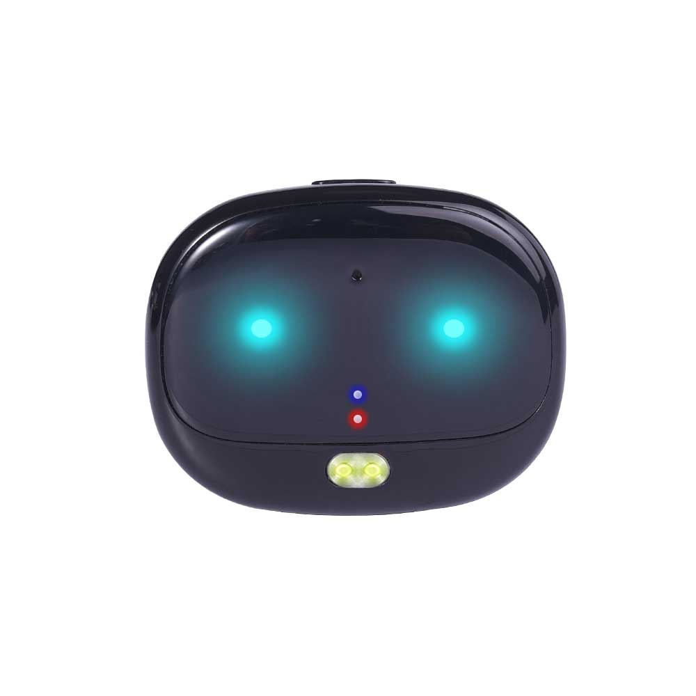

# Reachfar - RF-V47

The RF-V47 is a compact IP67 waterproof GPS tracker designed primarily for pets and personal safety. It combines hybrid positioning with GPS, AGPS and cell based fallback to provide reliable location reporting, plus features such as two way voice, ring to find and geo fence alerts. The unit is lightweight and built for daily wear and outdoor use, making it suitable for caregivers who need continual situational awareness.

As a Plaspy compatible device, the RF-V47 integrates with Plaspy’s tracking platform so location, alerts and simple telemetry appear in centralized dashboards and mobile interfaces. That integration makes it straightforward to monitor live position, receive low battery and geo fence notifications, and review historical routes from Plaspy while retaining the device behaviors useful for pet tracking, personal safety and light asset monitoring.

## Key Highlights

- Compatible with Plaspy for real time tracking and centralized visibility across web and mobile.
- Hybrid positioning using GPS plus AGPS with cell based LBS fallback for improved continuity.
- Compact IP67 waterproof enclosure and a lightweight form factor suited for pets and daily wear.
- Two way voice and one button call functionality for quick direct communication with the wearer.
- Multi day standby and continuous update capability to balance runtime and reporting needs.
- Safety oriented features including geo fence alerts, ring to find and historical route playback.
- Multi platform reporting options including web portal, smartphone apps and third party messaging integration.

## How It Works with Plaspy

When used with Plaspy the RF-V47 transmits position and status updates to Plaspy’s servers where location processing, alerting and history are presented through Plaspy dashboards and apps. Plaspy consolidates incoming data from the device and surfaces it as live location, activity logs and configurable notifications so caregivers and operators can act on events quickly.

- Live location updates and recent telemetry visible in Plaspy dashboards and mobile views.
- Geo fence events and historical route playback available for monitoring movement over time.
- Two way voice events and one button call records shown in activity logs for response tracking.
- Battery level reporting and low battery alarms forwarded to Plaspy for proactive alerts.
- Supplemental position uploads and fallback handling help maintain continuity when GPS signals are intermittent.

## Typical Use Cases

- Pet tracking for outdoor dogs and cats where waterproofing and ring to find are useful.
- Personal safety monitoring for children or elders needing quick location and call capability.
- Lightweight asset tracking for backpacks, luggage or small equipment requiring compact tracking.
- Outdoor activity monitoring and route history for caregivers who want movement insight.

## Why Choose This Tracker with Plaspy

The RF-V47 is a practical choice for organizations and individuals using Plaspy who need a small waterproof tracker with straightforward location reporting and built in voice capability. Its hybrid positioning and fallback behavior help maintain visibility in mixed signal environments while Plaspy provides centralized management, alerts and history playback for operational oversight.

Because the RF-V47 focuses on pet and personal safety scenarios, it pairs naturally with Plaspy’s core tracking and notification features without requiring complex configuration. If your monitoring needs grow into broader fleet or advanced telemetry, Plaspy supports additional device types that can extend capabilities beyond what a compact personal tracker provides.

To learn more about Plaspy and how compatible devices like the RF-V47 appear in the platform visit https://www.plaspy.com. Product specifications and availability can change over time, so please verify current details on the manufacturer site https://www.reachfargps.com/.
