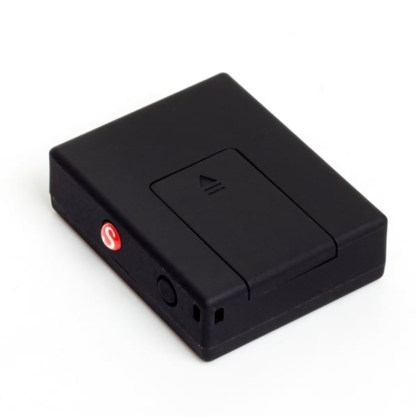

# Reachfar - RF-V6+

The REACHFAR RF-V6+ is a compact GPS tracker designed for discreet anti theft protection and portable vehicle tracking. It combines GPS, AGPS and LBS positioning with 2G GPRS TCP IP reporting and SMS controls to deliver real time tracking and alarm reporting for small assets, motorcycles, bicycles and luggage. Its small form factor and built in antennas make it suitable where a low profile device is required.

As a Plaspy compatible device, the RF-V6+ can forward position updates and alarm messages into the Plaspy platform for centralized visibility and operational oversight. Configurable reporting, SOS alerts, vibration tamper detection and geo fence notifications mean Plaspy users can receive immediate alerts and access historical location data while keeping deployment options flexible between TCP IP reporting and SMS based workflows.

## Key Highlights

- Compact and lightweight design for discreet mounting on small vehicles and portable assets
- GPS plus AGPS and LBS positioning for improved location availability across environments
- GPRS TCP IP reporting and SMS controls provide flexible integration paths with Plaspy
- Multiple alarm options including SOS alerts, vibration tamper detection and geo fence notifications
- IP66 weather resistance and built in antennas for reliable outdoor performance
- Rechargeable battery with extended standby profiles for days of operation between charges

## How It Works with Plaspy

When integrated with Plaspy, the RF-V6+ can send position and alarm data to Plaspy servers so fleet managers and operators get continuous tracking, immediate alerts and access to historical routes. Plaspy ingests the device reports and surfaces them in dashboards, notifications and reports that support operational decision making.

- Real time location updates and continuous tracking visible in Plaspy when GPRS reporting is configured
- Alarm delivery to Plaspy for vibration tamper events, geo fence breaches and SOS alerts
- Historical route playback and location history accessible in Plaspy for post incident review and reporting
- SMS based location replies and queries as a fallback that can be integrated into Plaspy workflows when needed
- Remote monitoring options including voice alert notifications used alongside Plaspy alerting for situational awareness

## Typical Use Cases

- Covert anti theft tracking for motorcycles and scooters where a small device reduces discovery risk
- Portable asset protection for luggage, bags or rented equipment with geo fence and alarm reporting
- Personal safety monitoring and lone worker oversight using SOS alerts and silent voice monitoring features
- Micro fleet or shared mobility tracking for small vehicles and rental fleets that need discreet real time location
- Short term or temporary deployments where compact size and simple reporting are priorities

## Why Choose This Tracker with Plaspy

The RF-V6+ is a practical choice for organizations that need a very small, Plaspy compatible tracker focused on location reliability and alarm delivery rather than extensive telemetry. Its combination of GPS AGPS and LBS positioning with configurable GPRS and SMS reporting gives Plaspy users flexible options to adapt to coverage and operational constraints. The device suits scenarios where discreet mounting, basic voice monitoring and multiple alarm channels are valuable.

If you want to learn more about how Plaspy can work with the Reachfar RF-V6+ and other compatible devices, visit https://www.plaspy.com. Product specifications, availability and manufacturer details can change over time, so please verify current specifications directly with the manufacturer at https://www.reachfargps.com/ before finalizing hardware choices.
