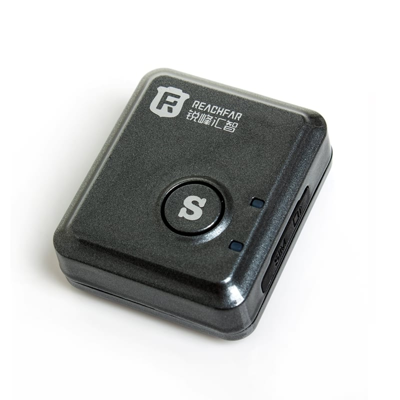

# Reachfar - RF-V8S

The Reachfar RF-V8S is a compact, screen free GPS tracker designed for discreet real time tracking and emergency communication. It combines a SiRF Star IV GPS chipset with AGPS assistance and quad band cellular connectivity to provide accurate positioning, long standby life and practical anti theft and personal safety features suitable for small assets, vehicles and people.

As a Plaspy compatible device, the RF-V8S can feed location and alarm events into Plaspy dashboards and mobile views for unified fleet and asset oversight. Its focus on SOS workflows, vibration and sound alarms, geo fencing and remote listen in makes the unit especially relevant where unobtrusive monitoring and rapid alerts are primary requirements.

## Key Highlights

- Plaspy compatible for straightforward integration into real time tracking and alerting workflows
- Accurate positioning with SiRF Star IV GPS and AGPS assistance, typically 5–15 meters under open sky
- Ultra compact form factor 40 × 34 × 14 mm and approximately 24 g for discreet placement
- Long standby life with high capacity internal battery providing up to about 12 days under typical conditions
- Built in SOS and anti theft features including one key silent SOS, auto dial to multiple contacts, vibration and sound sensors, and geo fence alarms
- Multiple alert paths through SMS control, manufacturer web portal and mobile apps for flexible monitoring

## How It Works with Plaspy

When connected to Plaspy, the RF-V8S uses its cellular link and standard platform methods to deliver position fixes and alarm events so devices appear on maps in near real time. Plaspy aggregates those feeds with other compatible hardware to provide consolidated tracking, notifications and historical reporting across vehicles and personal trackers.

- Real time location updates and position history shown on Plaspy maps and device lists
- SOS alerting with rapid notifications to preset contacts and Plaspy alert handlers
- Vibration and sound alarms routed into Plaspy for immediate anti theft and incident visibility
- Geo fence, SIM change, low battery and power off alerts forwarded to Plaspy and via SMS
- Remote listen in voice functions accessible through call features and SMS driven controls while Plaspy documents events

## Typical Use Cases

- Vehicle anti theft monitoring with discreet placement and immediate vibration or displacement alerts
- Personal emergency protection for children seniors or lone workers using SOS and silent auto dial
- Asset monitoring in warehouses transit or storage using geo fence and movement alarms
- Short term covert monitoring when a small screen free device and long battery life are needed
- Supplementary tracking in mixed fleets where Plaspy combines RF-V8S location data with other telemetry sources

## Why Choose This Tracker with Plaspy

The Reachfar RF-V8S offers a focused set of capabilities that align well with common Plaspy scenarios: accurate location, endurance for extended standby, and a suite of alarm and SOS options that prioritize quick awareness and response. Its simple hardware footprint and support for SMS and cloud based access make it a practical choice when you need discreet, reliable tracking integrated into a broader Plaspy deployment.

Learn more about Plaspy and how compatible devices are presented and managed on the main website https://www.plaspy.com. Product specifications availability and manufacturer details can change over time; please verify current specifications with the official ReachFar documentation at https://www.reachfargps.com/.
