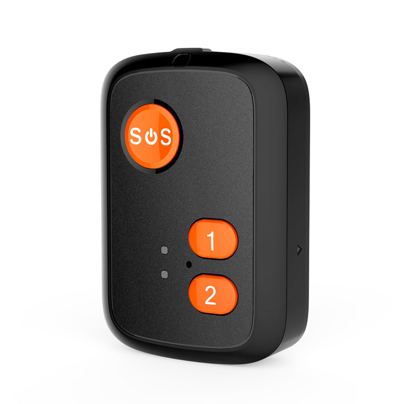

# Reachfar - V51

The V51 is a compact 4G personal GPS tracker designed for reliable Plaspy compatible monitoring of elderly people, children and other vulnerable users. Housed in an IP67 waterproof case, the V51 combines multi‑network cellular connectivity with GPS and Beidou satellite positioning for precise outdoor location, and smart fall‑detection and SOS features to notify caregivers instantly. Its small footprint and simple controls make it ideal for everyday wear or carry, while Plaspy integration enables centralized, real‑time tracking and alerting from a single dashboard.

The device supports real‑time tracking, historical route playback and geofencing via web and mobile apps, and offers practical utilities such as pill reminders, a pedometer, a talking clock and a remote “ring to find” function. While the V51 focuses on personal safety telemetry and emergency response, its Plaspy compatibility lets organizations manage personal trackers alongside other assets — and Plaspy also supports fleet management, anti‑theft workflows, ignition/immobilizer control and Bluetooth sensors for devices that include those features.

## Key Highlights

- Plaspy compatible for centralized, real‑time tracking and alerting across web and mobile platforms.
- Multi‑network support \(4G LTE, 3G WCDMA, 2G GSM\) for broad carrier coverage and roaming flexibility.
- High‑accuracy outdoor positioning with GPS + Beidou \(typical accuracy up to 5 meters\) and Wi‑Fi fallback \(~30 m\) for weak‑signal environments.
- Safety‑first features: SOS call, fall detection with automatic alerts, configurable speed‑dial numbers and SIM‑change notifications.
- IP67 waterproof housing for daily outdoor use and light immersion protection.
- User conveniences: pill reminders, pedometer, talking clock \(voice prompts\) and remote ring to locate the device quickly.
- Historical route playback and geofence alerts to support caregiver oversight and location history audits.

## How It Works with Plaspy

Integrating the V51 with Plaspy brings the tracker’s location, status and safety alerts into a unified monitoring environment. Plaspy ingests the device’s telemetry and events so caregivers or administrators can view live position, receive emergency notifications and review historical movement from a single interface. The V51 sends regular updates over cellular networks and falls back to Wi‑Fi positioning when satellite signals weaken, ensuring continuous tracking where possible.

- Real‑time location and telemetry updates via 4G/3G/2G cellular networks.
- SOS alerts and two‑way urgent call handling for immediate caregiver notification.
- Automatic fall‑detection alerts and configurable speed‑dial numbers for rapid response.
- Geofence events and historical route playback for route review and location auditing.
- Low battery and SIM‑change notifications to maintain reliable operation and security.
- Wi‑Fi positioning fallback \(≈30 m\) when GNSS signals are weak, improving indoor/location continuity.

## Technical Overview

| Connectivity | 4G LTE, 3G WCDMA and 2G GSM |
| --- | --- |
| Bands | Multi‑network support \(specific regional bands per SKU — consult product page\) |
| Power & Battery | Rechargeable internal battery with low battery alerts; refer to manufacturer specifications for capacity and run time |
| Interfaces & Controls | SOS button, speed‑dial configuration, remote ring function; pill reminder and talking clock controls |
| GNSS | GPS + Beidou satellite positioning; typical outdoor accuracy up to 5 meters; Wi‑Fi fallback positioning \(~30 m\) |
| Bluetooth | Not specified for external Bluetooth sensors in product information |
| Remote Management | Integrates with web platform and mobile app for real‑time tracking, historical route playback and geofencing |
| Protection & Form Factor | Compact personal tracker in an IP67 waterproof housing for daily outdoor use |

## Use Cases

- Eldercare monitoring — fall detection, SOS calling and caregiver alerts for daily safety and peace of mind.
- Child safety — discreet, wearable location tracking and geofence alerts for school or play areas.
- Lone worker protection — personal emergency signaling and location telemetry during isolated shifts.
- Short‑term rental and asset monitoring — compact tracking where recovery and basic anti‑theft notification are important.
- Care programs and assisted living — pill reminders, activity tracking \(pedometer\) and voice prompts to support routines.

## Why Choose This Tracker with Plaspy

The V51 delivers dependable personal‑safety tracking that integrates smoothly with Plaspy to provide caregivers and managers a single pane of glass for real‑time situational awareness. Its multi‑network cellular connectivity and dual‑satellite positioning improve outdoor accuracy, while Wi‑Fi fallback helps retain positioning indoors. Built‑in safety features such as SOS calls, fall detection and SIM‑change alerts reduce response time and operational uncertainty. The IP67 enclosure and compact design make the V51 easy to deploy and wear daily.

Choosing the V51 for Plaspy-compatible deployments is a practical option when the priority is personal safety telemetry rather than vehicle‑grade telemetry like fuel monitoring or ignition/immobilizer control. Plaspy’s broader platform also supports fleet management, anti‑theft workflows, ignition/immobilizer functions and Bluetooth sensors for devices that include those capabilities. For organizations that need a purpose‑built personal GPS tracker with strong emergency features and straightforward Plaspy integration, the V51 offers a balanced mix of accuracy, alerts and usability.

