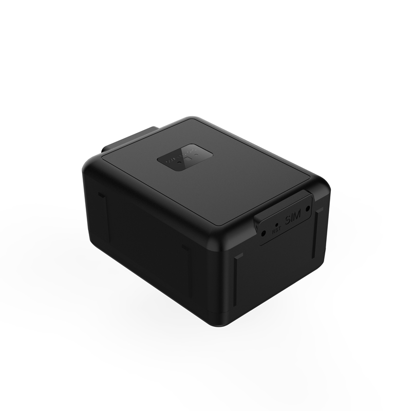

# Reachfar - V55

The Reachfar V55 is a compact, rugged 4G long standby GPS tracker designed for reliable, long term monitoring of vehicles and mobile assets. It combines satellite positioning with Wi Fi and cell tower assisted fixes to provide continued location data in urban and challenging signal environments, and it ships with an IP67 rated enclosure suitable for exposed vehicle and outdoor use.

As a Plaspy compatible device out of the box, the V55 integrates into Plaspy for real time tracking, configurable alerts, and historical playback. Its hybrid positioning and multi network connectivity make it a practical choice for fleet managers and asset operators who want straightforward commissioning and visibility on the Plaspy platform.

## Key Highlights

- Plaspy compatible for quick integration into live tracking dashboards and alerting workflows
- Hybrid positioning using GPS and Beidou plus Wi Fi and cell tower assistance to improve urban and indoor performance
- Multi network cellular coverage for broad regional reach and fallback across network generations
- Rugged IP67 enclosure suited to exposed vehicle and outdoor asset deployments
- Long standby design to support extended monitoring intervals between charges
- Platform features commonly include real time tracking, configurable alerts, and historical playback
- Integrated support for geofence monitoring with combined GPS and Wi Fi zonal accuracy

## How It Works with Plaspy

When connected to Plaspy, the V55 supplies GNSS fixes and positioning aid data so administrators and dispatchers can view live locations, receive alerts, and run playback and reports from the Plaspy interface. Plaspy consolidates the device inputs to improve situational awareness across mixed signal environments and to support operational workflows.

- Real time location updates delivered to Plaspy for immediate operational visibility
- Dual GPS plus Wi Fi geofence monitoring to reduce false alerts in urban areas
- Wi Fi and cell tower positioning used by Plaspy to supplement GNSS indoors or where satellite reception is limited
- Historical track playback available in Plaspy for auditing and analysis of movements
- Configurable alerts and reporting in Plaspy for movement, geofence events, and platform defined thresholds
- Support for vehicle telemetry workflows when I O inputs are present and configured according to the product manual

## Typical Use Cases

- Fleet management and dispatch where continuous location visibility is required
- Anti theft monitoring and asset recovery using live tracking and historical playback
- Remote equipment and trailer monitoring with long standby and weather resistant housing
- Urban delivery and last mile operations that benefit from Wi Fi and cell tower assisted fixes
- Telemetry augmented workflows where positional data is combined with vehicle state inputs

## Why Choose This Tracker with Plaspy

The V55 pairs rugged hardware and hybrid positioning with out of the box compatibility for Plaspy, making it a useful option for operators who need dependable tracking in mixed environments. Its long standby behavior and multi network connectivity help maintain visibility over extended periods, while Plaspy provides the platform tools for alerts, playback, and fleet level reporting.

To learn more about how Plaspy supports the Reachfar V55 and other compatible trackers visit https://www.plaspy.com. Product specifications and availability can change over time, so verify current technical details and supported variants on the manufacturer site https://www.reachfargps.com/ before procurement or deployment.
