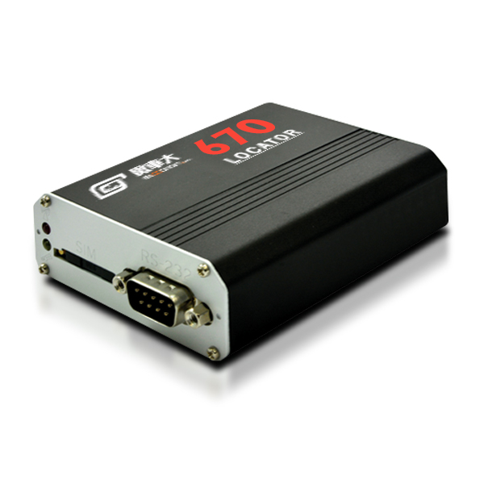

# Riti - 670 (IDU-300)

The RITI Locator 670 (IDU-300) is an in-vehicle GPS tracker designed for intelligent fleet management and continuous position monitoring. As a 3G IDU model it delivers frequent position reporting and high sensitivity GNSS reception, and it supports a range of peripherals commonly used in commercial vehicle telematics. Although this specific model is discontinued, its design emphasizes reliable location reporting, mileage tracking, voltage monitoring, and integration with external sensors.

This unit is Plaspy compatible and can forward GNSS and peripheral telemetry into Plaspy for live map visibility, alerts, and historical reporting. Its multi-sensor inputs and buffering capabilities make it practical for deployments that need anti-theft monitoring, cold chain oversight, or extended sensor integration within the Plaspy platform, especially in mixed or legacy fleets where the 670 remains in service.

## Key Highlights

- Plaspy compatible real time tracking with frequent position updates for responsive fleet visibility
- High sensitivity GNSS reception for improved satellite lock in challenging environments
- Per second mileage reporting to support accurate odometer and route analytics in Plaspy
- Battery voltage monitoring to surface low voltage conditions and support preventive alerts
- Broad peripheral support including temperature and fuel level inputs plus DVR and SOS integration for extended telemetry
- Local data buffering to retain records during connectivity gaps and forward them when cellular recovers
- Remote diagnostics and firmware update support to simplify device maintenance and keep deployments Plaspy ready

## How It Works with Plaspy

When integrated with Plaspy, the Locator 670 sends GNSS positions and connected sensor data to the platform where it appears on live maps, triggers alerts, and feeds reporting and analytics. Plaspy ingests the device telemetry to provide operational oversight, event management, and historical records useful for dispatch and compliance workflows.

- Real time location and telemetry updates with reporting intervals suitable for responsive tracking
- Per second mileage and odometer data used in Plaspy trip reports and utilization dashboards
- Battery voltage inputs generate warnings and can inform maintenance alerts within Plaspy
- Temperature sensor and fuel level inputs support cold chain and fuel monitoring workflows and alerts
- SOS events and external peripheral signals such as DVR or RFID are forwarded to Plaspy as alarms and logged events
- Local buffering ensures stored records are uploaded to Plaspy after connectivity is restored

## Typical Use Cases

- Fleet management and dispatch requiring accurate mileage and route auditing
- Cold chain and temperature controlled deliveries where sensor inputs and alerts protect perishables
- Vehicle safety and public safety fleets using SOS reporting and integrated DVR events
- Fuel and asset monitoring with external sensor and RFID support to reduce shrinkage
- MDVR and telematics integrations that synchronize event data for compliance and incident review

## Why Choose This Tracker with Plaspy

The Locator 670 (IDU-300) can be a practical fit for organizations using Plaspy when legacy devices remain in service or when existing fleets already use the model. Its frequent position updates, per second mileage reporting, and battery voltage monitoring help produce cleaner analytics and timely alerts in Plaspy, while broad peripheral compatibility allows teams to extend telematics workflows without extensive custom integration.

Because the 670 is a discontinued 3G model, organizations planning new large scale or long term deployments should also consider current device options that match modern cellular standards. For mixed or legacy environments where the IDU-300 continues to operate, it still provides reliable GNSS and sensor feeds, local buffering, and Plaspy compatible data streams that support effective fleet operations.

To learn more about Plaspy and how compatible devices are used within the platform visit https://www.plaspy.com. Product specifications, availability, and manufacturer details can change over time, so verify current specifications and support information on the official RITI website at https://www.riti.com.tw/.
