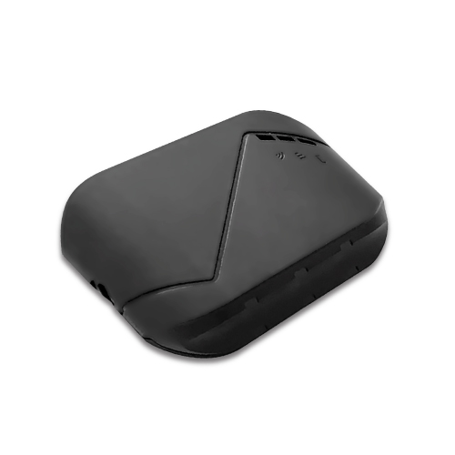

# Riti - 690s (IDU-403)

The Riti Locator 690s (IDU-403) is a compact, professional GPS tracker and GNSS data logger designed for dependable fleet management and IoT deployments. Built to collect high frequency location and vehicle telemetry, the device combines GPS and GLONASS positioning with assisted location options and robust cellular communications to provide continuous tracking, event reporting and per second logging suitable for vehicle use.

As a Plaspy compatible device out of the box, the 690s integrates its position fixes, odometer data and event records directly with Plaspy dashboards and mobile apps. That compatibility makes the 690s a practical choice where operators need reliable live maps, alerting and historical playback alongside vehicle health signals such as battery voltage and fault reports.

## Key Highlights

- Plaspy compatible tracker offering real time tracking and fleet management integration.
- Dual GNSS reception with assisted location to improve fix speed and reliability.
- Cellular telemetry support for continuous data delivery and backend redundancy.
- Onboard intelligence including per second odometer and a built in G sensor for driving event detection.
- Local data buffering to preserve records during poor network conditions and auto upload when connectivity returns.
- Vehicle monitoring features such as battery voltage tracking and fault reporting for proactive oversight.
- Small, lightweight form factor suitable for discreet vehicle and asset deployments.

## How It Works with Plaspy

The 690s streams location fixes, telemetry and event data into Plaspy using the device transport options, where Plaspy ingests and presents that data on live maps, in reports and as operational alerts. Plaspy normalizes incoming telemetry so fleet managers can combine 690s feeds with other assets and use Plaspy tools for monitoring, reporting and incident response.

- Live location updates and route playback for real time visibility and historical review.
- Driving event alerts from the built in G sensor forwarded to Plaspy for safety monitoring.
- Odometer and mileage reporting to support maintenance schedules and usage analysis.
- Battery voltage and vehicle fault reports delivered to Plaspy for fleet health dashboards and low battery alerts.
- Local buffer upload behavior that preserves continuity of data during intermittent connectivity.
- Transport flexibility that helps maintain delivery of telemetry to Plaspy under varying network conditions.

## Typical Use Cases

- Fleet management and dispatch with real time tracking, route history and mileage reporting.
- Vehicle safety programs using driving event detection to support coaching and compliance.
- Anti theft and rapid response workflows using SOS and location telemetry paired with Plaspy alerts.
- Logistics and temperature sensitive cargo management when combined with external sensors and Plaspy alerting.
- Telematics and MDVR integration where straightforward backend transport and fault reporting are required.

## Why Choose This Tracker with Plaspy

The Riti 690s (IDU-403) is a useful choice for organizations that want a compact GNSS data logger that pairs directly with Plaspy for fleet visibility and operational reporting. Its combination of frequent location logging, event detection and local buffering helps maintain reliable telemetry in real world vehicle deployments, while Plaspy provides the dashboards, alerts and reporting to turn that telemetry into actionable insight.

If you want to learn more about how Plaspy can use the Riti 690s for fleet tracking and operational oversight, visit the Plaspy website at https://www.plaspy.com. Product specifications, availability and manufacturer details can change over time, so please verify current technical information and compatibility with the manufacturer documentation at https://www.riti.com.tw/.
