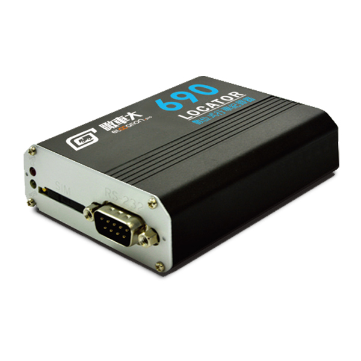

# Riti - 690T (IDU-400)

The 690T (IDU-400) from Riti is a digital vehicle recorder and GPS tracker built for modern fleet operations that need a cloud based alternative to paper tachographs. It collects driving records and operational data and uploads them for long term retention, simplifying audit trails and making inspection retrieval more efficient. The device is positioned for fleets that require frequent sampling and reliable record keeping to support compliance and operational oversight.

As a Plaspy compatible device, the 690T integrates into cloud fleet management workflows to provide real time tracking, searchable archives, and event visibility without the administrative burden of paper logs. Its combination of high frequency telemetry, driver identification options and flexible I/O expansion makes it relevant for organizations using Plaspy to centralize reporting, incident review, and regulatory retention.

## Key Highlights

- Cloud tachograph replacement with searchable, auditable retention for inspection and reporting
- High frequency telemetry capable of up to one sample per second for precise trip and event reconstruction
- Multi band LTE connectivity with fallback support for broad cellular coverage across regions
- Flexible I O expansion supporting driver ID, temperature sensing and emergency input options
- Backup lithium ion battery and continuous voltage monitoring to continue reporting after vehicle power loss
- Tri axis G sensor for automatic logging of harsh acceleration braking and cornering events
- Remote OTA updates and parameter configuration to reduce field visits and keep settings current

## How It Works with Plaspy

The 690T is designed to stream location data, driving records and event telematics into Plaspy compatible fleet platforms where that information is visualized, archived and acted upon. Once data reaches the cloud, Plaspy dashboards provide live monitoring, historical replay, and tools for inspection and audit workflows that rely on the recorder's uploads.

- Real time location and telemetry updates populate Plaspy dashboards for live monitoring and historical replay
- Driving records are stored and indexed in Plaspy for compliance reporting and audit downloads
- Driver identification entries are captured and tagged for duty logs and driver assignment tracking
- Temperature sensing inputs feed cold chain event data into Plaspy for refrigerated fleet oversight
- Digital inputs such as SOS and door or ignition status generate event flags used in Plaspy alerts and reports
- Harsh event snapshots from the G sensor populate driver behavior and incident reports inside Plaspy

## Typical Use Cases

- Fleet management and compliance where cloud retention replaces paper tachographs for inspections
- Driver behavior analysis and coaching using harsh event data to improve safety
- Cold chain monitoring for refrigerated vehicles with temperature logging and audit records
- Event recording and post incident auditing using SOS and digital input events
- Integrated telematics for routing, dispatch and performance reporting combining location and driver ID

## Why Choose This Tracker with Plaspy

The Riti 690T (IDU-400) provides a practical path from paper based tachographs to a cloud centric telematics setup when paired with Plaspy. Its emphasis on frequent sampling, long term retention and flexible I O options makes it a solid choice for fleets that need verifiable records, clearer audit trails, and richer operational context than location alone.

For organizations seeking consolidated visibility and simplified inspection workflows, the 690T's design complements Plaspy's dashboards and reporting tools to reduce administrative overhead and support regulatory needs. Learn more about Plaspy on the main website https://www.plaspy.com. Product specifications and availability can change over time so please verify current details on the manufacturer site https://www.riti.com.tw/.
