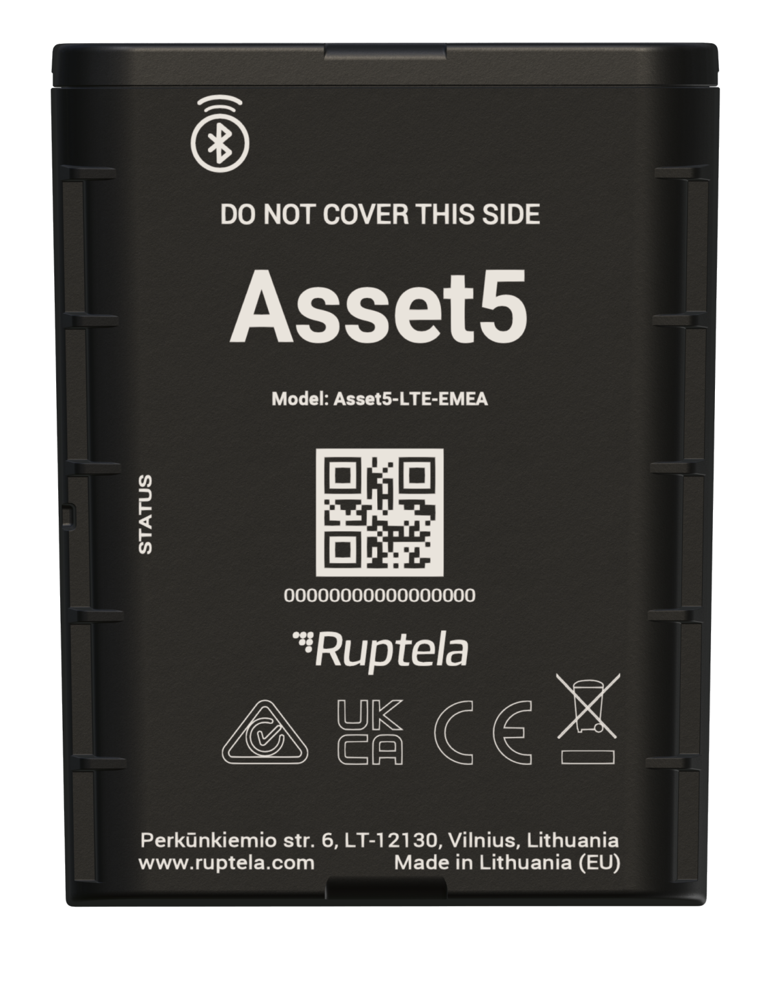

# Ruptela - Asset5

The Asset5 is a compact, rugged GPS tracker designed for long term, low maintenance monitoring of unpowered or high value assets. Built for harsh environments, it combines multi constellation GNSS positioning with global cellular connectivity and Bluetooth LE for on site setup and sensor support. With IP68 protection and conservative reporting intervals that can yield up to three years of autonomous operation, Asset5 is intended for extended deployments where frequent servicing is impractical.

As a device that is Plaspy compatible out of the box, Asset5 integrates into Plaspy workflows to deliver resilient positioning, low power telemetry, and motion aware reporting. When connected to Plaspy, asset owners and fleet managers gain continuous visibility, event alerts, and historical reporting for trailers, containers, rental equipment, construction tools, and other remote assets that require reliable long term tracking.

## Key Highlights

- Plaspy compatible tracker optimized for long battery life and minimal maintenance
- Designed for long autonomous operation under conservative reporting schedules
- Multi constellation GNSS positioning for improved location resilience
- Global cellular connectivity options with fallback modes to maximize coverage
- IP68 rated compact housing for outdoor and harsh environment use
- Bluetooth LE for local configuration and BLE advertisement to support on site workflows
- Built in accelerometer to increase reporting frequency on motion for theft recovery

## How It Works with Plaspy

Asset5 sends location fixes and essential telemetry over cellular networks to Plaspy so teams can monitor assets in real time, receive alerts, and review historical activity. Plaspy uses the device data to populate dashboards, trigger notifications, and support operational reporting. Bluetooth LE enables local configuration and on site identification workflows that complement remote monitoring in Plaspy.

- Real time location and telemetry delivered to Plaspy for live tracking and monitoring
- Motion based reporting increases update frequency when assets move for rapid response
- Battery and device health telemetry visible in Plaspy to support maintenance planning
- Bluetooth LE configuration and BLE advertisement mode to assist local site identification
- Automated alerts and historical reporting to track movements, dwell times, and events

## Typical Use Cases

- Stolen asset recovery and security monitoring for trailers, containers, and parked equipment
- Rental and leasing operations where long battery life reduces downtime and servicing costs
- Oversight of containers, trailers, and construction equipment across dispersed sites
- Tracking non powered implements and attachments in agriculture and mining environments
- Asset inventory and site presence detection using BLE advertisement for local workflows

## Why Choose This Tracker with Plaspy

Asset5 is a practical option for organizations that need dependable, low maintenance GPS tracking for assets that are not continuously powered. Paired with Plaspy, it provides a straightforward way to add long term location visibility, motion aware reporting, and equipment status monitoring without frequent battery changes or intensive field servicing. The device design and Plaspy analytics together support anti theft measures, fleet oversight, and telemetry driven maintenance planning.

Learn more about Plaspy on the main website https://www.plaspy.com. Product specifications, availability, and manufacturer details can change over time, so please verify current specifications and official documentation on the manufacturer's website https://ruptela.com/ before making purchasing or deployment decisions.
