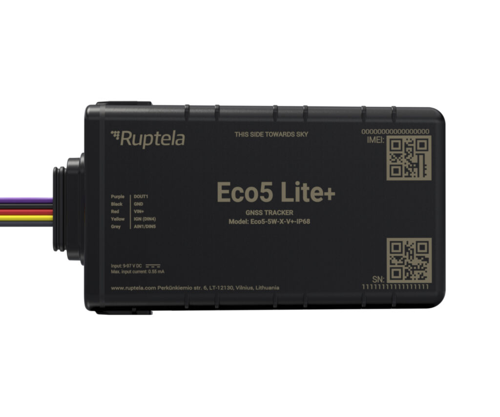

# Ruptela - Eco5 Lite+

The Eco5 Lite+ from Ruptela is a compact, rugged GPS tracker designed for demanding vehicle tracking applications and built to work seamlessly as Plaspy compatible hardware. Engineered for electric vehicles \(EVs\), motorcycles and low-power fleets, the Eco5 Lite+ combines premium u‑blox GNSS accuracy, BLE 5.0 accessory support and industry-grade protection \(IP68\) to deliver dependable real-time tracking and telemetry in harsh environments.

Optimized for energy-efficient operation and straightforward integration, the Eco5 Lite+ supports multiple cellular options \(4G Cat‑1 and 4G Cat‑M1 variants with 2G fallback\), internal backup battery operation and digital I/O for simple ignition or immobilizer workflows. Fleet managers and integrators looking for a Plaspy compatible GPS tracker will find the Eco5 Lite+ well suited for fleet management, anti-theft recovery and telemetry-driven insights.

## Key Highlights

- Plaspy compatible compact GPS tracker ideal for EVs, motorcycles and discreet installs.
- Rugged IP68 enclosure and slim 21 mm profile for durable, low-visibility mounting.
- Wide vehicle power acceptance \(9–97 V DC\) and internal backup battery for uninterrupted tracking.
- Premium u‑blox GNSS for reliable positioning plus jamming detection for enhanced anti-theft security.
- BLE 5.0 for Bluetooth sensors and wireless accessories to extend telemetry and sensor coverage.
- Low power consumption \(deep-sleep current as low as 0.5 mA\) for long-term or battery-operated deployments.
- Multiple cellular variants \(4G Cat‑1, 4G Cat‑M1 with 2G fallback\) for robust real-time tracking connectivity.
- Simple I/O \(1 DOUT, 1 DIN, 1 analog/digital combo\) for ignition detection, immobilizer control and sensor integration.

## How It Works with Plaspy

When paired with Plaspy, the Eco5 Lite+ streams location and telemetry data securely to your Plaspy dashboard for real-time tracking, alerts and historical reporting. Plaspy-compatible integration uses the device’s GNSS and cellular connectivity to provide live position updates while BLE and onboard I/O enable extended telemetry and control features.

- Real-time location and telemetry updates sent over 4G Cat‑1 or Cat‑M1 \(with 2G fallback\) for continuous fleet visibility.
- Ignition and driver events detected via the digital input \(DIN\) and combined analog/digital input for behavior monitoring and event logging.
- Fuel monitoring and analog sensor integration using the combo analog/digital input for telemetry-rich reports.
- Remote immobilizer or basic vehicle control achievable through the digital output \(DOUT\) when managed from Plaspy workflows.
- Bluetooth sensors and beacons connected via BLE 5.0 extend Plaspy telemetry to temperature, proximity or accessory ID use cases.
- Jamming detection alerts and internal backup battery preserve logs and trigger notifications during power interruptions, improving anti-theft response.

## Technical Overview

| Manufacturer | Ruptela |
| --- | --- |
| Connectivity | 4G Cat‑1 and 4G Cat‑M1 variants with 2G fallback |
| Bands | Band support varies by cellular variant and market \(operator-dependent\) |
| Power & Battery | High-voltage acceptance 9–97 V DC; internal backup battery; deep-sleep current as low as 0.5 mA |
| Interfaces \(I/O\) | 1 digital output \(DOUT\), 1 digital input \(DIN\), 1 combo analog/digital input |
| GNSS | Premium u‑blox GNSS module \(GPS/GNSS positioning\) |
| Bluetooth | BLE 5.0 for Bluetooth sensors and beacons |
| Security | Jamming detection and backup logging on power loss |
| Remote Management | Supported by Ruptela Device Center \(local configuration\) and Device Management Platform for remote configuration and firmware updates |
| Form Factor & Protection | Compact, slim profile \(21 mm thick\), rugged IP68 enclosure for vehicle and outdoor use |

## Use Cases

- Motorcycle and electric vehicle tracking for fleets requiring discreet, low-profile GPS trackers.
- Real-time fleet management and telemetry for route monitoring, uptime and driver behavior analysis.
- Anti-theft and stolen vehicle recovery with jamming detection, backup battery logging and remote immobilizer control via DOUT.
- Integration with fuel monitoring solutions and analog sensors for fuel consumption reporting and optimization.
- BLE sensor deployments for temperature-sensitive cargo, proximity detection or accessory identification.

## Why Choose This Tracker with Plaspy

The Eco5 Lite+ offers a balanced blend of durability, low power consumption and flexible connectivity that makes it an effective Plaspy compatible GPS tracker for modern fleets, especially in the e-mobility sector. Its broad voltage range \(9–97 V DC\) and slim IP68-rated design simplify installation across electric vehicles and motorcycles, while BLE 5.0 and a premium u‑blox GNSS module add precision and sensor extensibility for richer telemetry.

For fleet managers focused on real-time tracking, telemetry and anti-theft protection, the Eco5 Lite+ delivers actionable data to Plaspy with minimal maintenance. Onboard I/O supports ignition detection and immobilizer workflows, and the Device Management Platform enables scalable remote configuration and firmware updates — reducing field visits and improving uptime. Choose the Eco5 Lite+ when you need a compact, energy-efficient GPS tracker that integrates cleanly with Plaspy for reliable fleet management, fuel monitoring and security operations.

