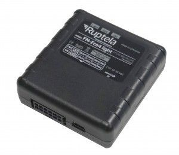

# Ruptela - FM-ECO4 Light

The Ruptela FM-ECO4 Light is a compact GPS tracking device designed for vehicle monitoring and fleet management. It combines a small form factor with built-in GPS and GSM antennas to provide continuous location tracking, route logging, and core telemetry such as speed, mileage, and fuel-related indicators. The device also includes features aimed at fleet operations like driver registration, temperature monitoring for sensitive cargo, geozone configuration, and functions for controlling vehicle behavior.

As a Plaspy compatible device, the FM-ECO4 Light can feed vehicle and event data into the Plaspy platform to enhance fleet visibility and operational oversight. Plaspy can use the device data to display live location and history, trigger alerts, and include the FM-ECO4 Light in reporting workflows, allowing fleet managers to apply the device capabilities within Plaspy dashboards and monitoring tools.

## Key Highlights

- Compact size and easy installation suitable for discreet vehicle mounting
- Internal GPS and GSM antennas for integrated positioning and connectivity
- Core vehicle tracking: location, speed, route history, mileage and fuel-related tracking
- Driver registration and identification to attribute trips and behavior to individuals
- Temperature monitoring for refrigerated and temperature sensitive transport
- Remote ignition blocking capability for vehicle immobilization when required
- Internal geozones and anti-jamming features to support reliable tracking and virtual boundaries

## How It Works with Plaspy

When connected to Plaspy, the FM-ECO4 Light provides the location and event streams that Plaspy ingests to offer consolidated fleet monitoring and reporting. Plaspy leverages the device data to build timelines of vehicle activity, raise operational alerts, and generate analytics that help teams make data driven decisions.

- Live location tracking and historical route playback within Plaspy maps
- Geofence and internal geozone alerts for entry and exit notifications
- Driver activity and assignment tracking based on driver registration information
- Temperature alerts and monitoring for shipments requiring controlled conditions
- Reporting and analytics for route efficiency, fuel oversight, and fleet utilization
- Use of remote control features exposed by the device, such as ignition blocking, when enabled and configured in Plaspy

## Typical Use Cases

- Fleet monitoring and dispatch for small and midsize vehicle fleets
- Route optimization and performance tracking to reduce operational costs
- Fuel and mileage oversight to support cost control and maintenance planning
- Temperature controlled logistics for food, pharmaceuticals, and perishable goods
- Driver behavior monitoring and accountability using driver registration features

## Why Choose This Tracker with Plaspy

The FM-ECO4 Light is a practical choice where compact form factor and a broad set of fleet oriented features are important. Its combination of location tracking, driver identification, temperature monitoring, and remote control options makes it well suited for mixed fleets and businesses that need concise telemetry without heavy hardware complexity. Paired with Plaspy, the device data becomes actionable through centralized dashboards, alerts, and reporting workflows that support everyday fleet operations.

If you want to learn more about how Plaspy can use data from compatible devices like the Ruptela FM-ECO4 Light, visit https://www.plaspy.com to explore platform capabilities. Product specifications and availability can change over time, so please verify current technical details and manufacturer guidance on the official Ruptela site https://ruptela.com/.
