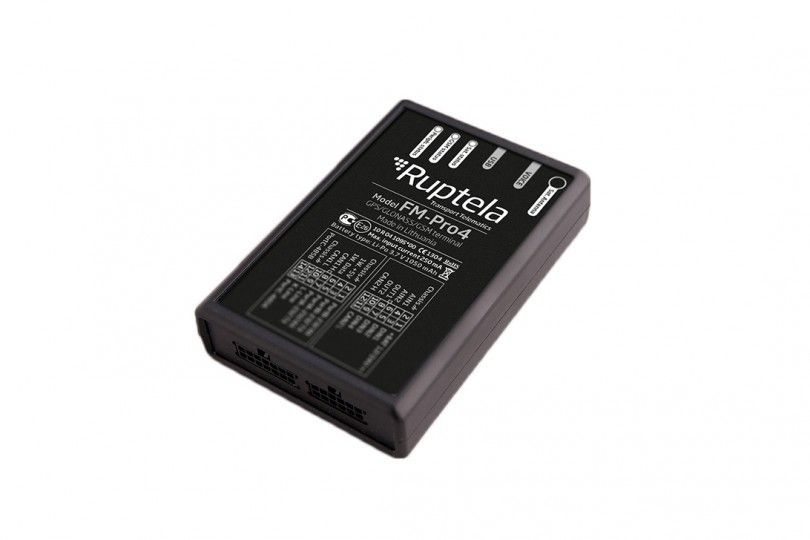

# Ruptela - FM-Pro4

The Ruptela FM-Pro4 is an advanced GPS tracker specifically designed for heavy commercial vehicles such as trucks, agriculture machinery, and other special machinery. Its main purpose is to track and monitor the vehicle's activity parameters, providing valuable data for fleet monitoring and control. With the ability to obtain data from the vehicle's on-board computer \(CANbus\) using FMS and J1708 standards, the FM-Pro4 goes beyond traditional GPS tracking.

One of the key features of the FM-Pro4 is its versatility. It can be used for a variety of purposes, including fleet monitoring and control, route and order optimization, fuel control and management, eco-driving style implementation, and temperature control. With RS232 and RS485 ports, the FM-Pro4 can be connected to up to 12 fuel level sensors, ensuring accurate fuel monitoring and control. Additionally, it is equipped with a 1-Wire interface, allowing for the installation of additional accessories to enhance vehicle safety and control.

With its reliable and functional design, the FM-Pro4 helps reduce daily vehicle-related costs, saves employees' time, and improves overall business results. It offers a range of functionalities, including driver behavior monitoring \(Eco-Drive\), on-board computer data reading \(CANbus: J1708, FMS\), temperature monitoring, driver registration and identification, remote ignition blocking, fuel monitoring, internal geozones, antijamming capabilities, and various features via SMS.

