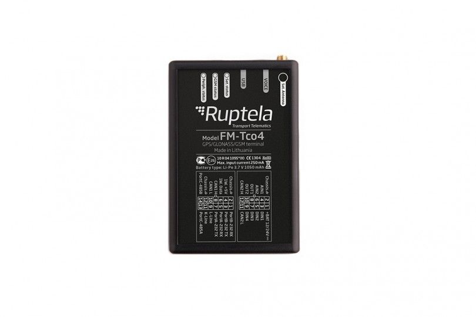

# Ruptela - FM-Tco4 HCV

The Ruptela FM-Tco4 HCV is a purpose built GPS tracker for modern heavy commercial vehicles and transportation equipment. It collects vehicle and operational data to support route and order optimization, fuel control, eco driving analysis, remote tachograph reading and downloading, and temperature monitoring for refrigerated assets. The device is positioned as a comprehensive telematics unit for fleets that need both location tracking and in-depth vehicle information.

As a Plaspy compatible device, the FM-Tco4 HCV can feed its telematics into Plaspy to provide centralized visibility and operational control. Plaspy can consume the tracker data to display location, vehicle status, tachograph information, and temperature readings alongside other fleet data, helping fleet managers make informed decisions and act on exceptions quickly.

## Key Highlights

- Designed for heavy vehicles with features focused on fleet operational needs such as tachograph reading and fuel control
- Reads vehicle on board computer data in J1708 and FMS standards for richer vehicle status and diagnostics
- Dual CAN functionality enables simultaneous capture of CANbus and digital tachograph data
- Supports multiple accessory interfaces and refrigerated unit monitoring including ThermoKing Optitemp and Carrier systems
- Built in support for temperature monitoring and condition alerts useful for refrigerated transport
- Offers SMS accessible features for selected remote actions and quick status checks where supported

## How It Works with Plaspy

When connected to Plaspy, the FM-Tco4 HCV supplies live and historical telematics that Plaspy surfaces via dashboards, maps, and reports. This enables fleet teams to combine location tracking with vehicle and cargo related telemetry for operational oversight and compliance workflows.

- Live location and status monitoring displayed on Plaspy maps and vehicle timelines
- Tachograph and vehicle data available for compliance reporting and download tracking
- Temperature and refrigeration readings integrated into alerts and trend reports for cold chain oversight
- Event driven alerts and geofence notifications to detect route deviations or unauthorized activity
- Driver behavior and eco drive indicators used in Plaspy reporting to support fuel and safety programs
- Aggregated historical reports for performance review, maintenance planning, and operational analysis

## Typical Use Cases

- Long haul and regional trucking fleets requiring remote tachograph reading and centralized tracking
- Refrigerated transport operations monitoring temperatures and refrigerated unit status across routes
- Fleet programs focused on fuel control and eco drive optimization to reduce operating costs
- Mixed fleets that need accessory integrations for safety and driver control alongside location tracking
- Operations that require consolidated reporting and alerts for compliance and logistics planning

## Why Choose This Tracker with Plaspy

The FM-Tco4 HCV is a strong fit for organizations that need more than basic GPS location. Its support for vehicle bus standards, dual CAN capture, and refrigerated unit monitoring makes it suitable for heavy vehicles, refrigerated trailers, and fleets with compliance requirements. Paired with Plaspy, those vehicle level inputs are turned into actionable insight through unified dashboards, alerts, and reports.

Plaspy is designed to centralize telematics from compatible devices so fleet managers can monitor operations, analyze trends, and respond to events from a single platform. For fleets that require tachograph access, temperature control oversight, and comprehensive vehicle data, the FM-Tco4 HCV plus Plaspy provides a practical combination to improve visibility and operational efficiency.

To learn more about how Plaspy works with compatible devices visit the main website https://www.plaspy.com. Product specifications and availability can change over time, so please verify current capabilities and technical details on the manufacturer site https://ruptela.com/ before making procurement decisions.
