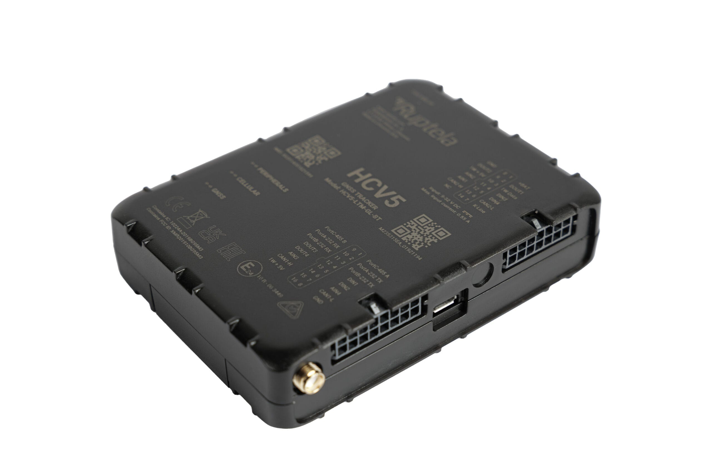

# Ruptela - HCV5

The HCV5 is a professional vehicle tracking and telematics unit designed to be Plaspy compatible for streamlined fleet management and secure asset tracking. Built for commercial fleets, the HCV5 delivers continuous GPS positioning, robust telemetry and broad vehicle data capture from CAN and OBD interfaces to enable real-time tracking, driver identification, fuel monitoring and remote tachograph downloads — all visible in Plaspy dashboards and reports.

Compact and rugged, the HCV5 combines LTE Cat M1 / NB‑IoT connectivity with 2G fallback, premium U‑blox GNSS, BLE 5.1, tamper and jamming detection, plus extensive I/O for sensors and actuators. Its feature set is tailored for operators who need reliable real-time tracking, anti-theft measures and deep vehicle telemetry, and it integrates with device management tools for remote configuration and firmware management when deployed with Plaspy.

## Key Highlights

- Plaspy compatible: native integration-ready data streams for real-time tracking and fleet management dashboards.
- Multi-network connectivity: LTE Cat M1 and NB‑IoT with 2G fallback for broad coverage and resilient telemetry delivery.
- Comprehensive vehicle data: dual CAN and K‑line OBD access for fuel monitoring, driver behavior analysis and tachograph downloads.
- Advanced positioning: premium U‑blox GNSS receiver for dependable location accuracy in urban and rural environments.
- Extensive I/O & expansion: multiple digital and analog inputs/outputs, serial ports, SD storage and BLE 5.1 for sensors and accessories.
- Security features: tamper and jamming detection plus an internal 1050 mAh backup battery to protect against power loss.
- Compact, discreet installation: small ergonomic housing \(101 × 74 × 23 mm\) with concealed mounting and OBD splitter options.

## How It Works with Plaspy

When paired with Plaspy, the HCV5 sends continuous location and vehicle telemetry over cellular networks to the Plaspy platform. Plaspy ingests GNSS coordinates, CAN/OBD parameters and event-driven inputs to provide real-time tracking, alerts, reports and historical analysis that fleet managers use to improve efficiency and security.

- Real-time GPS location and telemetry updates delivered to Plaspy for live map views and geofence alerts.
- Vehicle CAN/OBD data for fuel monitoring, engine status and remote tachograph downloads \(where supported by the vehicle\).
- Event inputs for ignition and sensor-triggered alerts \(digital inputs capture door, alarm or ignition events\).
- Support for remote immobilizer integration via configurable digital outputs when deployed and authorized by installers.
- BLE 5.1 support for external sensors and beacons \(refrigeration, cargo condition sensors or driver ID tags\) integrated into Plaspy reporting.

## Technical Overview

| Connectivity | LTE Cat M1 / NB‑IoT with 2G fallback |
| --- | --- |
| Bands | Region-dependent radio variants; consult product documentation for supported bands |
| Power & Battery | Operates on 9–32 V DC; internal 1050 mAh backup battery for power-loss operation |
| Interfaces | 2× CAN, K‑line \(OBD/CAN reading\), 4× digital inputs \(DIN\), 4× analog inputs \(AIN\), 4× digital outputs \(DOUT\), 1‑wire |
| Serial / Expansion | 2× RS232, 1× RS485 \(transparent channel\), SD card slot, internal memory 8 MB, optional external GNSS antenna |
| GNSS | Premium U‑blox GNSS positioning \(module model per variant; see datasheet\) |
| Bluetooth | BLE 5.1 for sensors, beacons and short-range data exchange |
| Remote Management | FOTA \(via GPRS\), USB firmware update, compatible with Ruptela Device Center and Device Management Platform |
| Environmental & Certifications | Operating temperature −20 °C to +60 °C; certified CE, E‑mark, UKCA, FCC, PTCRB, IC, EAC, RCM, CITC |
| Form Factor | Compact housing 101 × 74 × 23 mm; supports concealed installations and OBD splitter harnesses |

## Use Cases

- Fleet management and optimization: real-time tracking, route analysis and driver coaching to reduce fuel and maintenance costs.
- Cargo and refrigeration monitoring: BLE and serial integrations for refrigeration unit telemetry and cargo condition sensing.
- Remote tachograph compliance: automated tachograph downloads and driver identification for HOS and compliance workflows.
- Stolen-vehicle recovery and anti-theft: tamper/jamming detection, backup battery and remote immobilizer integration for fast response.
- Mixed-asset deployments: trailer tracking, axle-weight sensors and multi-vehicle telemetry aggregation under one Plaspy account.

## Why Choose This Tracker with Plaspy

The HCV5 is engineered for fleet operators who require reliable real-time tracking, full vehicle telemetry and scalable device management. Its combination of LTE Cat M1 / NB‑IoT connectivity, premium GNSS positioning and rich I/O makes it ideal for advanced telemetry use cases — from fuel monitoring and driver behavior analysis to remote tachograph handling and asset security. When integrated with Plaspy, the HCV5 becomes a single-source solution for fleet visibility, anti-theft protection and operational analytics.

Operationally, the HCV5 reduces downtime through remote configuration and FOTA support, simplifies international deployments with broad certifications, and supports discreet installations for security-sensitive vehicles. For organizations using Plaspy for fleet management, the HCV5 delivers the telemetry, connectivity and extensibility needed to turn raw vehicle data into actionable insights.

