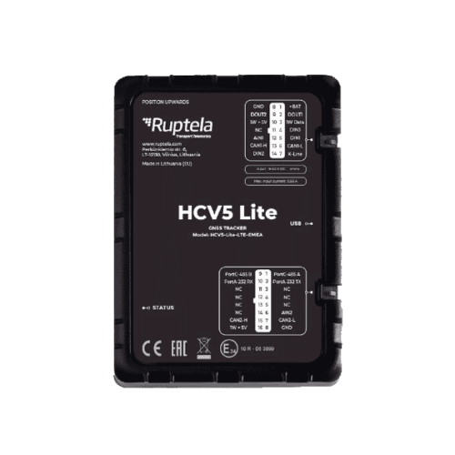

# Ruptela - HCV5 Lite

The Ruptela HCV5 Lite is a premium GPS tracker designed specifically for heavy and light commercial vehicle tracking. This cutting-edge device is packed with advanced features that are tailored to meet the evolving needs of commercial vehicle operations. With the HCV5 Lite, you can stay connected and in control of your fleet, optimizing your operations and improving efficiency.

One of the standout features of the HCV5 Lite is its versatility. It is suitable for all types of vehicles and offers multiple inputs, outputs, and interfaces for accessories. Additionally, it is equipped with BLE 5.0 technology, ensuring seamless connectivity and compatibility with a wide range of devices.

Installation and use of the HCV5 Lite are incredibly easy. Its small size and ergonomic design make it easy to install in any vehicle. The screwless housing and dedicated tools, such as the device center and installation assistant, further simplify the installation process. For added convenience, the HCV5 Lite also offers wireless solutions and the option for concealed OBD installation, as well as tailored harnesses for a seamless integration into your vehicle.

In terms of performance, the HCV5 Lite delivers excellence. It features premium GNSS technology by U-blox, ensuring accurate and reliable positioning. The device is built with high-quality components, guaranteeing durability and longevity.

Security is a top priority with the HCV5 Lite. It is equipped with jamming detection technology, alerting you to any attempts to interfere with the device's signal. Additionally, it has a backup battery, ensuring continuous operation even in the event of a power failure.

The HCV5 Lite offers broad vehicle coverage, supporting a wide range of OBD and CANbus parameters, including proprietary manufacturer data. This comprehensive coverage allows you to monitor and analyze various vehicle metrics, enabling you to make informed decisions and optimize your fleet's performance.

With the HCV5 Lite, you get a full solution from one supplier. The GPS tracking device is combined with suitable accessories, providing a seamless and integrated solution for your commercial vehicle tracking needs.

