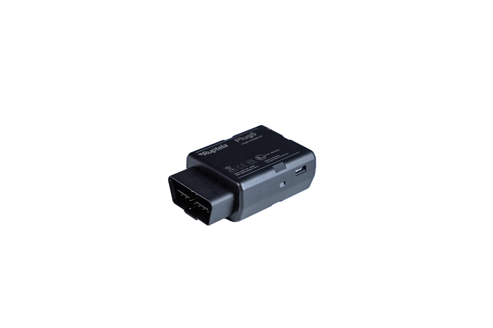

# Ruptela - Plug5

Plug5 is an OBD/OBDII dongle style GPS tracker from Ruptela designed for plug and play vehicle telematics and fleet management. It provides GNSS positioning and mobile connectivity with fallback options, while exposing vehicle diagnostics and manufacturer parameters via the OBD interface and CAN. The form factor and automatic vehicle model detection make it well suited to commercial rollouts where fast deployment and rich vehicle data are priorities.

As a Plaspy compatible device, Plug5 integrates into Plaspy’s fleet management workflows to deliver location, telemetry, and event data into centralized dashboards and reports. That compatibility allows fleets to combine Plug5 vehicle intelligence with Plaspy visibility, alerts, and operational controls for monitoring, maintenance planning, and incident response without complex bespoke integrations.

## Key Highlights

- Plug and play OBD dongle design with automatic vehicle model detection for rapid fleet installation.
- GNSS positioning and modern mobile connectivity with fallback for reliable real time tracking.
- Access to OBDII and CAN vehicle parameters plus proprietary manufacturer data for richer telemetry and fuel monitoring.
- BLE 5.1 support for accessory sensors and driver identification options to extend monitoring capabilities.
- Motion and crash detection with onboard inertial monitoring to enable safety and incident workflows.
- Internal data buffering and secure communications to preserve continuity and protect transmitted data.
- Designed for commercial fleets with a wide operating range and optional harnesses for mixed vehicle types.

## How It Works with Plaspy

When connected to Plaspy, Plug5 streams position and vehicle telemetry into Plaspy’s platform so operators can monitor vehicles, respond to events, and generate operational reports. The device’s buffering behavior and event detections help maintain data continuity and support reconstruction of incidents after connectivity interruptions.

- Real time location updates and vehicle telemetry visible in Plaspy dashboards for live fleet monitoring.
- Event and alert forwarding to Plaspy for geofence triggers, motion or crash detection, unplug or tamper signals, and other critical notifications.
- Trip segmentation and driver behaviour insights using ignition and motion derived events for reporting and analytics.
- Fuel and consumption monitoring derived from OBD and CAN parameters to support cost control and maintenance planning.
- Buffered uploads after connectivity restoration to ensure historical continuity in Plaspy reports and investigations.
- Supplementary sensor data from BLE accessories integrated into Plaspy for cargo, environment, or driver ID use cases.

## Typical Use Cases

- Commercial fleet tracking for vans, cars, and light trucks requiring fast deployment and centralized monitoring.
- Lease and rental operations that need easy plug and play installation with automatic vehicle recognition.
- Delivery and logistics fleets that benefit from real time location, ETA visibility, and fuel optimization.
- Anti theft and stolen vehicle recovery workflows leveraging unplug detection, jamming alerts, and last known positions.
- Driver identification and safety programs using BLE tags and accelerometer events to assess behaviour and incidents.

## Why Choose This Tracker with Plaspy

Plug5 is a practical choice for organizations that want a compact OBD solution delivering both location and deep vehicle telemetry without complex installation. Its combination of diagnostic access, accessory support, event detection, and data buffering aligns with the monitoring, reporting, and alerting features available in Plaspy, allowing fleets to consolidate operational oversight on a single platform.

For fleets planning broad rollouts, Plug5’s plug and play form factor and remote management capabilities make it easier to scale device deployments while keeping configuration and updates manageable. If your operational needs include real time tracking, fuel and vehicle health insight, theft protection, or driver analytics, Plug5 paired with Plaspy offers a practical, Plaspy compatible foundation for commercial telematics projects.

Learn more about Plaspy on the main website https://www.plaspy.com. Product specifications and availability can change over time, so verify current technical details and regional variants on the manufacturer site https://ruptela.com/.
