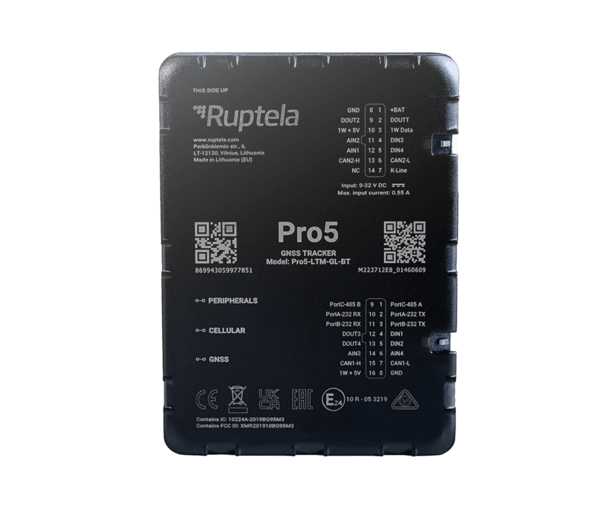

# Ruptela - Pro5

The Pro5 from Ruptela is a professional grade GPS tracker designed for heavy vehicles such as trucks, buses and specialized machinery. Built for demanding fleet environments, it combines modern cellular connectivity with a premium GNSS receiver and wireless accessory support to deliver continuous position updates, vehicle telemetry and on device event logging required for fleet operations and anti theft workflows.

As a fully Plaspy compatible device, the Pro5 can be integrated into Plaspy for unified fleet monitoring and management. Its vehicle focused interfaces and telemetry capabilities make it a suitable choice where operators need reliable live tracking, reporting and remote device management at scale through the Plaspy platform.

## Key Highlights

- Purpose built for heavy vehicles with rugged enclosure and compact footprint.
- Cellular connectivity with modern low power wide area and 2G fallback for broad coverage.
- Premium GNSS module for reliable real time positioning and on device logging.
- Rich vehicle interfaces and I O to capture ignition, inputs and control outputs for fleet telemetry.
- BLE 5.1 support for wireless sensors and driver identification peripherals.
- On device backup battery and tamper detection to support anti theft workflows.
- Remote management options including over the air updates and centralized provisioning.

## How It Works with Plaspy

When paired with Plaspy, the Pro5 streams position and vehicle telemetry into Plaspy dashboards so operators can monitor fleets in real time, review historical routes and configure alerts. Plaspy ingests the Pro5 data and presents unified views for location, event detection and operational reporting, enabling faster responses and better oversight.

- Real time location and telemetry delivered to Plaspy for live tracking and map visibility.
- Vehicle data ingestion to Plaspy for fuel monitoring, diagnostics and trailer or EBS related parameters where available.
- Event and accelerometer reporting in Plaspy for harsh driving, tamper and incident awareness.
- BLE sensor and driver identification data mapped to assets and drivers inside Plaspy.
- Tamper and jamming notifications plus on device logs available for post event analysis within Plaspy.
- Remote configuration and firmware update workflows integrated into fleet provisioning processes.

## Typical Use Cases

- Fleet anti theft and recovery for trucks and heavy equipment using tamper alerts and backup power.
- Fuel and efficiency monitoring using vehicle bus derived fuel and diagnostic parameters.
- Driver behaviour monitoring and coaching using accelerometer and vehicle telemetry data.
- Trailer and multi unit fleet tracking including trailer EBS and asset association.
- Public transport and heavy machinery telemetry for maintenance planning and operational visibility.

## Why Choose This Tracker with Plaspy

The Pro5 offers a balanced combination of vehicle grade interfaces, reliable positioning and secure communications that make it a good match for fleets using Plaspy. Its I O set and vehicle bus access enable deeper telemetry and diagnostics where vehicle systems allow, while BLE and serial options add flexibility for accessories and driver identification.

If your operations require a Plaspy compatible tracker engineered for heavy vehicles and rich data collection, the Pro5 is designed to provide the telemetry, anti theft features and remote management workflows that support scalable fleet deployments. Learn more about Plaspy on the main website https://www.plaspy.com and verify current product specifications and availability with the manufacturer documentation at https://ruptela.com/. Product specifications and availability can change over time so confirm details on the manufacturer site for the latest information.
