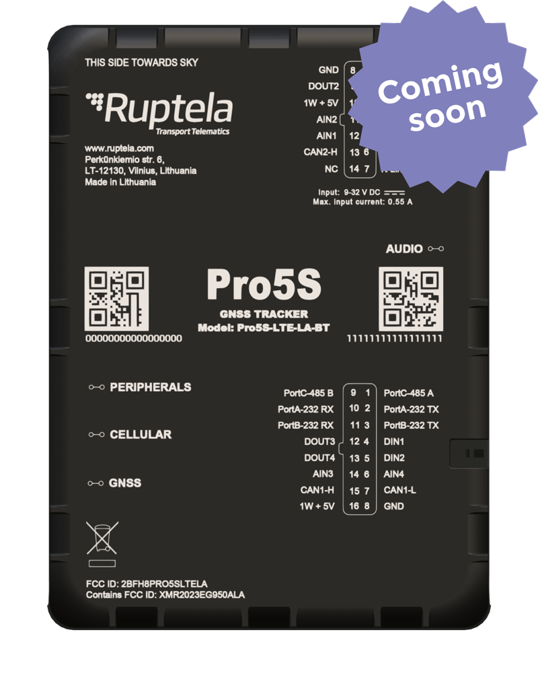

# Ruptela - Pro5S

The Pro5S by Ruptela is a professional GPS tracker engineered for LATAM fleets and commercial deployments. Plaspy compatible out of the box when configured for telematics ingestion, Pro5S combines reliable 4G \(LTE Cat4\) connectivity with 3G fallback, a Swiss-made u‑blox GNSS module and a compact, harness-ready form factor to deliver real-time tracking, robust telemetry and two‑way driver communication for fleet management, logistics and rental operations.

Built for operators who require precise positioning, deep CANbus access and strong anti-theft measures, Pro5S supports extensive vehicle interfaces, Bluetooth LE 5.1 for wireless sensors and accessories, and built-in audio for voice interaction. Its tamper, jamming and impact detection, internal data logging and 1050 mAh backup battery ensure continuity of service and improved asset protection when integrated with Plaspy dashboards and alerting.

## Key Highlights

- Plaspy compatible GPS tracker with LTE Cat4 and 3G fallback for continuous real-time tracking across LATAM networks.
- High‑precision positioning using a u‑blox GNSS module with GPS, GLONASS and Galileo plus an external GNSS antenna option for obstructed environments.
- Full vehicle telemetry via 2×CAN and 1×K‑line, enabling RPM, engine load, fuel monitoring \(including EV parameters\) and advanced driver behaviour analysis.
- Two‑way audio \(3.5 mm jack\) and Bluetooth LE 5.1 support for driver communication and Bluetooth sensors, improving safety and sensor telemetry.
- Advanced security features: tamper, jamming and impact detection, internal accelerometer, sleep mode and internal data logging to prevent data loss during outages.
- Flexible I/O and serial interfaces \(digital/analog/RS232/RS485/1‑Wire\) for integrations such as ignition/immobilizer control, sensors and trailer CAN reading.
- Robust storage options with internal memory and microSD support \(up to 32 GB\) for extended offline logging and incident reconstruction.

## How It Works with Plaspy

When deployed with Plaspy, Pro5S streams the vehicle’s location and telemetry to the platform in real time, enabling live maps, route playback and actionable alerts. Plaspy ingests GNSS positions, CAN‑derived parameters and I/O events, so fleet managers can monitor performance, safety and security from a single console.

- Real-time location and telemetry updates: GNSS positions \(GPS/GLONASS/Galileo\) and timestamps feed Plaspy for accurate tracking and geofencing.
- Ignition and immobilizer support: CAN and digital inputs enable ignition status monitoring and remote ignition block capability for anti-theft response.
- Fuel monitoring and EV telemetry: CAN‑derived fuel consumption, engine load and EV parameters can be visualized in Plaspy for fuel monitoring and eco‑driving reports.
- Bluetooth sensors and accessories: BLE 5.1 allows Plaspy to capture temperature, door/movement sensors and wireless trailer IDs for cargo condition monitoring.
- Driver interaction and voice status: built‑in audio communication supports two‑way driver contact and can enhance driver coaching workflows when combined with Plaspy alerts.

## Technical Overview

| Model | Pro5S \(Pro5S‑LTE‑LA‑BT LATAM variant\) |
| --- | --- |
| Connectivity | 4G LTE \(LTE Cat4\) with 3G fallback |
| Bands / Region | LATAM‑optimised variant \(Pro5S‑LTE‑LA‑BT\); bands vary by regional SKU |
| GNSS | u‑blox GNSS module: GPS, GLONASS, Galileo; external GNSS antenna supported |
| Dimensions | 101 × 74 × 23 mm \(compact, harness‑ready\) |
| Power & Battery | Input 9–32 V DC; internal 1050 mAh backup battery for power‑loss operation |
| Memory | 8 MB internal \(~39,000 records\) plus microSD support up to 32 GB \(~250M records\) |
| Interfaces | 2×CAN, 1×K‑line, 4×DIN, 4×AIN, 4×DOUT, 1‑Wire, 2×RS232, 1×RS485, ignition/driver ID options |
| Bluetooth | Bluetooth LE 5.1 for sensors and accessories |
| Audio | 3.5 mm audio jack for two‑way driver communication |
| Sensors & Security | 3‑axis accelerometer, tamper detection, jamming and impact detection, sleep mode, internal data logging |
| Remote Management | Support for Ruptela device management tools and FOTA via vendor platform |
| Form Factor & Installation | Compact enclosure with dedicated harnesses and optional FMS/OBDII/EasyCAN accessories |

## Use Cases

- Fleet management and logistics: real-time tracking, route optimisation and driver behaviour monitoring for trucks and delivery fleets.
- Anti-theft and recovery: tamper/jamming detection plus remote ignition block capability to secure high-value assets and rental vehicles.
- Fuel monitoring and eco-driving programs: CAN-derived fuel and EV metrics support fuel monitoring, preventive maintenance and driver coaching.
- Cargo condition and trailer integration: BLE sensors and trailer CAN reading \(EBS, TPMS, tilt, axle load\) for refrigerated or sensitive cargo visibility.
- Construction and rental fleets: robust connectivity and internal logging ensure continuity on sites with intermittent coverage and secure rental/car‑sharing operations.

## Why Choose This Tracker with Plaspy

Choosing Pro5S for Plaspy deployments delivers a balanced mix of precision positioning, deep vehicle telemetry and operational security. Its u‑blox GNSS, extensive CAN and I/O matrix, and Bluetooth sensor support mean Plaspy users get richer telemetry — from ignition and RPM to fuel and EV parameters — enabling smarter fleet management decisions. Built-in anti-theft measures \(tamper, jamming, impact detection\) together with remote immobilizer capability provide an extra layer of asset protection that integrates with Plaspy alerts and workflows.

For fleet operators focused on uptime, the Pro5S’ internal logging, microSD support and backup battery help avoid data gaps, while Ruptela’s management tools and FOTA support simplify device maintenance and configuration. When combined with Plaspy’s mapping, reporting and alerting, Pro5S becomes a reliable foundation for real‑time tracking, telemetry-driven maintenance, driver coaching and secure fleet operations across LATAM.

