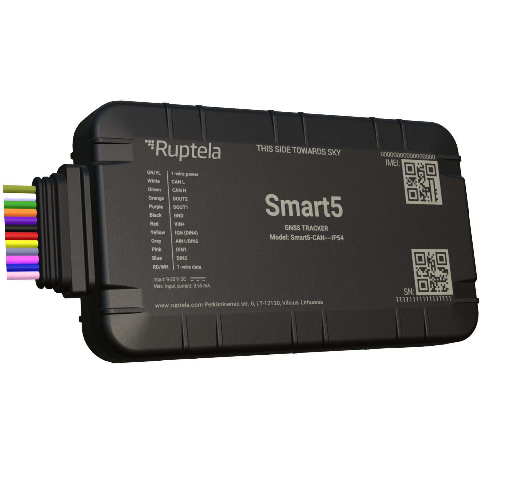

# Ruptela - Smart5

Smart5 is a compact, hard‑wearing GPS tracker designed for robust fleet management and deep vehicle data integration. It provides cellular connectivity with LTE Cat 1 and 2G fallback for reliable real‑time tracking across broad coverage areas. Built to read CANbus and OBD data including CustomCAN, Smart5 captures diagnostic and vehicle state information while offering form factor options for discreet or rugged installation.

As a Plaspy compatible tracker, Smart5 pairs with Plaspy to deliver live maps, alerts and fleet dashboards that turn raw telemetry into operational insight. Its ability to surface vehicle diagnostics, fuel metrics and sensor readings makes it a practical choice for fleets that use Plaspy for monitoring, maintenance workflows and anti‑theft response.

## Key Highlights

- Plaspy compatible GPS tracker with LTE Cat 1 connectivity and 2G fallback for consistent real‑time tracking.
- CANbus and OBD data reading including CustomCAN support for diagnostic and fuel related telemetry.
- Two body options: slim IP54 housing for discreet installs and rugged IP68 housing for harsh environments.
- Bluetooth LE 5.0 support for wireless sensors and accessories to monitor cargo condition and auxiliary telemetry.
- Security features such as jamming detection and power disruption alerts to support anti‑theft workflows.
- Internal buffering and backup power support continuous data capture during temporary connectivity interruptions.

## How It Works with Plaspy

When integrated with Plaspy, Smart5 streams location and vehicle telemetry so fleet teams can monitor assets in real time and analyze historical performance. Plaspy ingests GNSS fixes, CAN/OBD records and sensor inputs from the device to populate maps, alerts and reporting tools that support daily operations and long term planning.

- Real time location updates and multi constellations GNSS positioning visible on Plaspy live maps and dashboards.
- Vehicle diagnostics from CANbus and OBD feed Plaspy reports for engine state, fault awareness and operational trends.
- Fuel monitoring and analog inputs supply Plaspy with consumption data for reporting and cost analysis.
- Bluetooth sensor readings appear alongside location so Plaspy can track temperature sensitive cargo and other conditions.
- Security events such as jamming detection and power disruption generate immediate notifications inside Plaspy.
- Local buffering ensures data continuity and later upload to Plaspy after temporary loss of cellular connectivity.

## Typical Use Cases

- Fleet anti‑theft and immobilization workflows that combine alerts with remote outputs and monitoring in Plaspy.
- Mixed fleet management for cars, vans and heavy machinery where CAN and OBD telemetry is required.
- Fuel monitoring and consumption analysis for cost control and fleet efficiency programs.
- Refrigerated and cargo transport monitoring using Bluetooth sensors plus GPS tracking for route and condition oversight.
- Rental, leasing and construction fleet tracking where rugged hardware and local buffering help ensure data capture.

## Why Choose This Tracker with Plaspy

Smart5 provides a balanced set of capabilities that align with common fleet management needs when used with Plaspy. Its vehicle connectivity options extend tracking beyond location to include diagnostics, fuel metrics and event detection, which Plaspy converts into operational dashboards, alerts and reports. The availability of slim and rugged housings, together with security and buffering features, helps deploy the device across diverse fleet scenarios.

For organizations looking to combine rich vehicle telemetry with a cloud platform, Smart5 and Plaspy offer a practical pairing that supports live visibility, preventive maintenance insights and anti‑theft workflows without unnecessary complexity.

Learn more about Plaspy on the main website https://www.plaspy.com. Product specifications, availability and manufacturer details can change over time, so please verify current technical information on the official manufacturer website https://ruptela.com/
