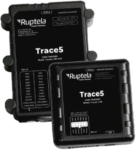

# Ruptela - Trace5

The Ruptela Trace5 is a compact GNSS based vehicle tracker designed for efficient vehicle tracking and fleet management. It combines premium GNSS positioning with 4G connectivity and a rugged IP67 rated housing to deliver reliable location information in a variety of operational environments. The device is intended for use across logistics, delivery, utility fleets and other vehicle based use cases where durability and accurate tracking are important.

As a Plaspy compatible device, the Trace5 can feed vehicle location and status into Plaspy for centralised monitoring and fleet oversight. Its small form factor, robust construction, and accessory options make it suitable for mixed fleets and installations where resilience and discreet placement are required. Plaspy users can leverage the Trace5 to increase visibility, enhance operational reporting, and improve day to day fleet management.

## Key Highlights

- Compact GNSS based tracker that prioritises reliable position reporting and continuous operation.
- 4G connectivity for timely data transmission suitable for real time and near real time tracking.
- Rugged IP67 rated housing built to withstand water, dirt, and mechanical exposure.
- Designed for ease of use with a small form factor, screwless housing, and complementary installation tools.
- Security focused features including jamming detection, back up battery and TLS v1.2 encryption in supported variants.
- Available accessory ecosystem and tailored harnesses to support different mounting and wiring approaches.
- Full solution approach combining the tracker and matching accessories from a single supplier.

## How It Works with Plaspy

When integrated with Plaspy, the Trace5 provides consistent location and device status updates so fleet teams can monitor assets from a single platform. Data from the device is presented in Plaspy for situational awareness, alerting, and reporting to support operational decisions.

- Real time and historical location visibility for individual vehicles and whole fleets.
- Configurable alerts and notifications for events such as movement, stop durations, or geofence transitions.
- Fleet monitoring dashboards and summary reports to track utilization and operational performance.
- Device status and health indicators to surface connectivity or tamper signals within Plaspy.
- Event export and reporting options to support operational workflows and compliance review.
- Centralised device inventory and grouping to manage large deployments efficiently.

## Typical Use Cases

- Fleet tracking for logistics and last mile delivery operations requiring reliable location updates.
- Utility and service vehicles operating in harsh outdoor environments.
- Mixed fleet monitoring where compact and rugged devices help with discreet installations.
- Remote or exposed vehicle installations where IP67 protection provides added assurance.
- Businesses seeking a single vendor solution for tracker hardware and matching accessories.

## Why Choose This Tracker with Plaspy

The Trace5 is a practical choice for organisations that need a compact yet robust tracker that integrates into a broader fleet management platform. Its rugged housing and accessory options make it appropriate for vehicles that operate in demanding conditions, while the premium GNSS module supports accurate positioning to improve route oversight and asset tracking.

Paired with Plaspy, the Trace5 helps turn location data into operational insights without adding unnecessary complexity. Organisations can combine the Trace5 hardware with Plaspy monitoring, alerts, and reporting to improve visibility across fleets and support daily operational tasks. To learn more about Plaspy and how it can manage devices like the Trace5 visit https://www.plaspy.com. Product specifications and availability can change over time; please verify current details on the manufacturer site https://ruptela.com/.
