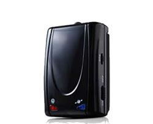

# Sanav - CT-24

The SANAV CT-24 is a compact GPS tracker designed for long battery operation and discreet placement. It combines high GPS and GSM sensitivities with a design that can operate effectively when mounted under a vehicle dashboard, removing the need for an external antenna. The CT-24 includes features such as two sets of open I O, a vibration sensor, reed switches, voice capability, a backup battery, and internal memory, making it a flexible option for multiple tracking scenarios.

As a Plaspy compatible device, the CT-24 fits well into fleet and asset monitoring workflows that prioritize long runtime and unobtrusive installation. Its internal memory and backup power make it suitable for situations where continuous connectivity may not be guaranteed, and its sensor options support event driven visibility within Plaspy. Plaspy can ingest location and status data from the CT-24 to provide consolidated monitoring, alerts, and reporting for operations that use this tracker.

## Key Highlights

- Long battery operation designed for extended deployments without frequent maintenance
- High GPS and GSM sensitivities that enable reliable reception even when placed out of sight
- Discreet installation possible without an external antenna for covert or neat installations
- Two sets of open I O for flexible integration with external inputs or events
- Built in vibration sensor and reed switches to detect movement or tamper events
- Backup battery and internal memory to retain data and improve reliability during interruptions
- Voice capability for audio related use cases where supported

## How It Works with Plaspy

When used with Plaspy, the CT-24 provides location and event data that Plaspy can present through its dashboards and reporting tools. Plaspy aggregates the tracker data to give operators a clear view of device status and historical movement, and to trigger operational alerts based on configured rules.

- Live location display and historical route playback in Plaspy dashboards
- Event alerts for movement, vibration, or reed switch triggers routed to operators
- Device status and power presence monitoring where the tracker reports backup battery or connectivity state
- Use of internal memory to sync stored positions and events into Plaspy when connectivity resumes
- Integration of I O events to reflect external inputs or custom triggers in Plaspy workflows

## Typical Use Cases

- Vehicle tracking for fleets that need discreet installation and long battery intervals
- Asset and container monitoring where extended runtime and internal storage are valuable
- Personal or pet tracking when a compact and unobtrusive tracker is required
- Covert tracking applications that benefit from internal antennas and low visibility
- Temporary deployments where easy installation and backup power are helpful

## Why Choose This Tracker with Plaspy

The CT-24 is a practical choice for organizations that need a balance of long battery life, discreet placement, and basic event sensing. Its combination of internal memory, backup battery, and sensor inputs makes it adaptable to both continuous fleet operations and intermittent connectivity scenarios. When paired with Plaspy, the CT-24 can contribute reliable position and event data to centralized monitoring, alerting, and reporting, helping teams maintain situational awareness across vehicles and assets.

If you want to explore how the SANAV CT-24 can fit into your tracking strategy, learn more about Plaspy on our main website https://www.plaspy.com. Product specifications, availability, and manufacturer details can change over time, so verify current technical information on the manufacturer site http://es.sanav.com/.
