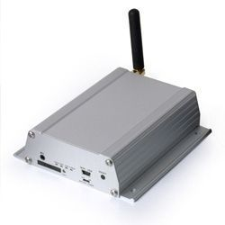

# Sanav - GS-819

The Sanav GS-819 is a vehicle grade GPS tracker built for reliable in car tracking. It pairs a high sensitivity SiRF Star IV GPS receiver with a Cinterion EHS6 3G module to provide robust position fixes and cellular communications. The device is housed in a rugged metallic enclosure and includes features commonly required for vehicle monitoring such as ACC on off detection, an embedded motion sensor, flash storage, and multiple configurable inputs and outputs.

As a Plaspy compatible device, the GS-819 can deliver the location and event data Plaspy needs for fleet monitoring and operational oversight. Its support for position reporting over 3G GPRS and SMS together with configurable auto reporting and I O options makes it straightforward to integrate tracking, ignition status, and basic sensor states into Plaspy dashboards, alerts, and reports.

## Key Highlights

- High GPS sensitivity using a SiRF Star IV receiver for reliable position fixes in vehicle environments
- 3G communications via a Cinterion EHS6 module with fallback reporting over GPRS or SMS
- Rugged metallic housing designed for durability in in car installations
- ACC on off detection plus embedded motion sensor for ignition and movement awareness
- Multiple I O options including 4 outputs, 2 analog inputs, and 4 digital inputs for connecting sensors and relays
- Flexible configuration through COTA SMS commands and PC software for tailored reporting
- Programmable auto reporting based on time or distance and built in flash memory for local data storage

## How It Works with Plaspy

The GS-819 sends position updates and event messages that Plaspy can receive and process to provide real time visibility and historical reporting. Plaspy ingests the tracker's reports and exposes them through maps, alerts, and logs so teams can monitor vehicles and respond to operational needs.

- Receive and display live location updates from the tracker on Plaspy maps
- Monitor ACC on off and motion events to track vehicle usage and ignition status
- Use digital and analog input states in Plaspy to trigger alerts or record sensor data
- Configure periodic reporting to feed Plaspy with consistent location samples for route and fleet analysis
- Generate reports and historical playback in Plaspy from the GS-819 position and event logs

## Typical Use Cases

- Fleet location tracking for delivery vans and service vehicles
- Ignition and movement monitoring for rental cars and company vehicles
- Remote control and status monitoring where outputs and inputs are used for relays or sensors
- Route verification and automated reporting for operational compliance
- Asset protection and recovery workflows using position reports and motion detection

## Why Choose This Tracker with Plaspy

The GS-819 is a good fit for organizations that need a purpose built vehicle tracker with multiple reporting methods and flexible I O options. Its rugged build and configurable reporting make it suitable for fleets that require dependable position data and simple sensor integration without extensive customization. When paired with Plaspy, the GS-819 provides the core location and event feeds that fleet managers use for visibility, alerts, and operational reporting.

If you want to learn more about how Plaspy can work with compatible devices like the Sanav GS-819 visit https://www.plaspy.com and review current product details on the manufacturer site http://es.sanav.com/ since specifications and availability can change over time and should be confirmed with the official documentation.
