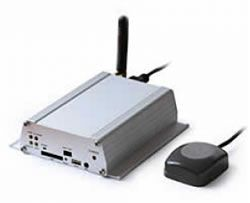

# Sanav - GX-101

The SANAV GX-101 is a high-quality GPS tracker designed specifically for vehicle tracking applications. It is equipped with a Siemens GSM module and a GM-158 \(MTK-3301 GPS chipset\) GPS receiver, ensuring accurate and reliable tracking capabilities. The rugged metallic structure of the GX-101 makes it ideal for use in-car environments, providing durability and longevity. With its opened I/Os, this tracker allows for easy integration with sensors and relays, expanding its functionality and versatility.

One of the standout features of the SANAV GX-101 is its ability to secure your favorite cars. Whether you're concerned about theft or simply want to keep track of your fleet, this tracker is an excellent choice. It offers full quadband GSM coverage, ensuring reliable communication and connectivity. The GX-101 also features a backup battery and internal memory, providing peace of mind in case of power loss or signal interruption. Additionally, it supports position tracking by time and distance, allowing for flexible and customizable tracking options.

Overall, the SANAV GX-101 is a reliable and feature-rich GPS tracker that is perfect for track & trace, vehicle recovery, and fleet management applications. Its robust construction, extensive I/O options, and advanced tracking capabilities make it an excellent choice for anyone looking to enhance the security and efficiency of their vehicle tracking systems.

### Key Features:

- Siemens GSM module and GM-158 \(MTK-3301 GPS chipset\) GPS receiver
- Rugged metallic structure for in-car environments
- Opened I/Os for easy integration with sensors and relays
- Full quadband GSM coverage
- Backup battery and internal memory
- Position tracking by time and distance

