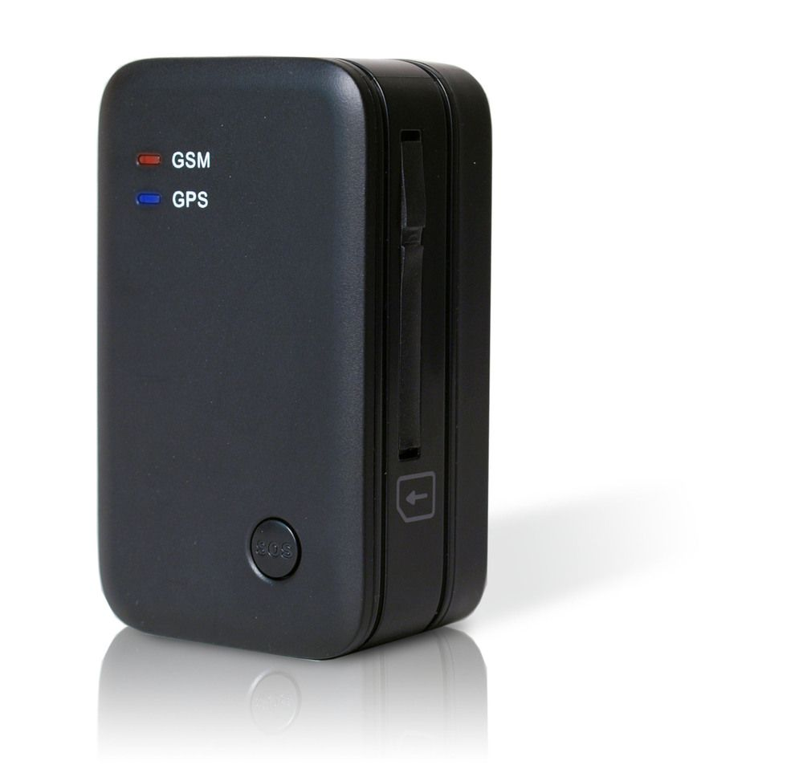

# Sanav - MU201S1

The SANAV MU201S1 is a compact GPS tracker designed primarily for pet and asset tracking and other scenarios that require extended battery life. It supports real time location updates and retrospective position reporting via GPRS, and includes remote configuration over both SMS and GPRS. The device offers event reporting such as SOS alerts, geofence violations, low power alerts, and movement based reports, making it suitable for continuous monitoring of small mobile assets.

As a device compatible with Plaspy, the MU201S1's reporting and alert features map naturally into fleet and asset monitoring workflows. Plaspy can ingest the MU201S1 location and event data to provide map visualization, alert routing, and historical playback. The tracker's remote configuration and firmware upgrade options also help reduce on site maintenance when used alongside a platform like Plaspy.

## Key Highlights

- Compact and lightweight design suitable for pets and portable assets, with small form factor and modest weight.
- Long battery operation supported by an internal rechargeable battery for extended field use.
- Real time and retrospective location reporting via GPRS plus position requests by SMS for flexible tracking.
- Remote configuration over SMS and GPRS and the ability to update firmware over the air to simplify maintenance.
- Built in motion sensing and support for time distance and movement based reporting to reduce unnecessary transmissions.
- Event reporting that includes SOS alerts, geofence violations for up to 10 circular zones, low power alerts, and power on reports.

## How It Works with Plaspy

When connected to Plaspy, the MU201S1 streams location and event data to the platform where it can be managed alongside other devices. Plaspy uses the device reports to deliver visibility and operational oversight across assets and pets without requiring constant manual polling.

- Live map view and historical playback of MU201S1 position reports for route review and incident analysis.
- Alert handling for SOS, geofence entry or exit, low battery, and power on events routed to operators or automated workflows.
- Scheduled and movement triggered reports presented in Plaspy reports and dashboards for operational reporting.
- Use of the MU201S1 remote configuration channels via Plaspy where supported to adjust reporting intervals and thresholds remotely.
- Device status monitoring in Plaspy, including battery condition and recent connectivity, to prioritize maintenance.

## Typical Use Cases

- Pet location and safety monitoring for pets that require lightweight trackers.
- Portable asset tracking for tools, equipment, and rental items with intermittent movement.
- Monitoring of field devices that benefit from long battery life and minimal maintenance.
- Personal safety tracking for workers in environments where SOS alerts and geofencing are useful.
- Situations that need both live tracking and retrospective position history for investigations or audits.

## Why Choose This Tracker with Plaspy

The MU201S1 pairs practical tracking features with flexible communications, making it a good match for Plaspy customers who need compact devices with strong battery endurance and event reporting. Its motion sensing, multiple reporting modes, and support for geofences let organizations tailor tracking behavior to conserve power while keeping required visibility.

Plaspy can present MU201S1 data alongside other fleet and asset devices, consolidating alerts and historical data into a single operational view. For deployments where remote configuration and over the air firmware updates matter, the MU201S1 reduces the need for physical access to devices and supports more efficient device management when integrated with a management platform.

To learn more about how Plaspy integrates with compatible trackers and to explore platform features visit https://www.plaspy.com. Product specifications, availability, and manufacturer details can change over time, so please verify current specifications and documentation on the manufacturer site http://es.sanav.com/ before final purchase or deployment.
