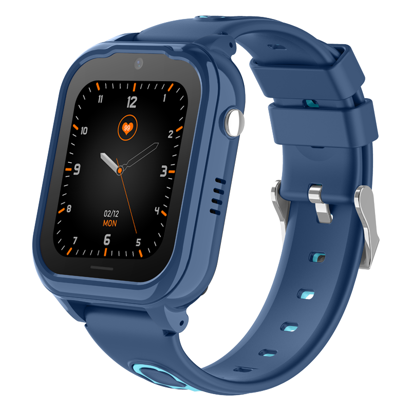

# Sentar - D38

The D38 is a compact, Android based kids GPS tracker designed as a smartwatch to support child safety and caregiver oversight. It combines multi mode positioning with a 30W camera, two way communication and a reachable SOS button in a wearable form factor that supports everyday durability. The device is intended to provide reliable indoor and outdoor location visibility for parents and caregivers through simple, continuous monitoring.

As an out of the box Plaspy compatible device, the D38 integrates its location and status data into the Plaspy platform for centralized monitoring and alerts. Plaspy can collect the D38 location updates, SOS events, connectivity and battery information to present live maps, notifications and historical playback, making the watch a practical endpoint for family safety workflows and supervised device fleets.

## Key Highlights

- Plaspy compatible kids smartwatch optimized for child safety and parental monitoring
- Multi mode positioning using GPS AGPS LBS and WiFi for improved indoor and outdoor visibility
- 30W on device camera and two way communication for visual confirmation and caregiver contact
- Dedicated SOS button for immediate alerting and location sharing with Plaspy users
- IPX7 waterproof rating for everyday durability around water and a compact 1.69 inch touch display
- 710mAh battery and Android based platform for sustained daily use and responsive alerts

## How It Works with Plaspy

When paired with Plaspy, the D38 transmits position and status updates so caregivers and administrators can monitor devices from a single platform. Plaspy normalizes the incoming signals and presents them as live positions, alerts and history to support situational awareness and response.

- Real time location updates and historical playback for tracking movement and checking past routes
- SOS and emergency notifications routed to Plaspy users for quick awareness and response
- Device health reporting including battery and connectivity status to help manage uptime
- Camera snapshots and communication events logged for visual verification and context
- Geofence alerts and arrival departure monitoring to support check ins at school or other points of interest

## Typical Use Cases

- Child safety and caregiver monitoring with live location and emergency alerts
- School and daycare arrival departure logging and geofence monitoring
- Supervised outdoor activities where waterproof protection and visual confirmation are helpful
- Family travel oversight and quick location lookups while away from home

## Why Choose This Tracker with Plaspy

The D38 pairs wearable convenience with Plaspy platform capabilities to provide a focused solution for families and caregivers. Its combination of multiple positioning methods, an SOS button and on device camera make it suited to situations where both indoor and outdoor visibility and quick communication matter. Being Android based and Plaspy compatible allows organizations to include the D38 as part of a broader monitoring strategy without requiring specialized hardware management.

If you want to evaluate the D38 for use with Plaspy, the device is a practical choice for child focused deployments and small supervised device fleets where real time tracking, alerts and status reporting are priorities. To learn more about Plaspy and how compatible trackers are supported, visit https://www.plaspy.com. Product specifications and availability can change over time, so please verify current details on the manufacturer site at http://www.sentarsmart.com/ before procurement.
