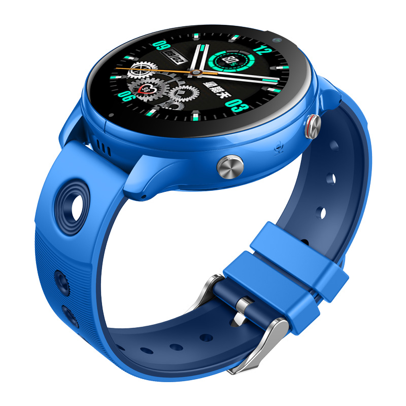

# Sentar - D40

The Sentar D40 is a child focused smartwatch designed to provide simple on-wrist communication and safety features for guardians and caretakers. Built around a 1.38 inch 2.5D curved HD round display, the D40 offers voice and photo interaction, a dedicated SOS button for emergency alerts, and an 800mAh battery intended for extended daily use. Its lightweight splash resistant IPX7 form factor and color options make it suitable for everyday wear by younger users.

As a Plaspy compatible device, the D40 brings location and device telemetry into a centralized monitoring workflow. The watch reports LBS and Wi‑Fi based location data, SOS events, and battery status so guardians can view real time updates inside Plaspy. That compatibility makes the D40 a practical choice for families and care providers who want child centric tracking and alerting managed alongside other devices in the Plaspy platform.

## Key Highlights

- Plaspy compatible for centralized visibility of location updates and alerts.
- 1.38 inch 2.5D curved HD round display with clear on wrist visuals.
- Nano SIM support and Android 8.1 enable voice and basic data services.
- Dedicated SOS button for immediate emergency notification to guardians.
- 800mAh battery designed for extended daily use with telemetry reported to Plaspy.
- IPX7 splash resistance suitable for routine child activity and light water exposure.
- Built in camera for basic photo capture to provide situational context.

## How It Works with Plaspy

When integrated with Plaspy, the D40 sends its positioning and device state so guardians can monitor location, receive alerts, and review device health from a single dashboard. Plaspy ingests LBS and Wi‑Fi based location information and treats SOS triggers and battery telemetry as actionable events within platform workflows.

- Real time location updates based on LBS and Wi‑Fi positioning shown inside Plaspy.
- SOS button alerts forwarded to guardian notification channels configured in Plaspy.
- Battery level and connectivity status available for proactive device monitoring.
- Photos captured on the device can be associated with events for situational awareness.
- Plaspy reporting and alert rules let guardians set geofences, schedules, and notification preferences.

## Typical Use Cases

- Guardian and parent monitoring for child safety and quick response to SOS alerts.
- Daily check ins where voice and messaging keep families connected.
- Indoor oriented tracking in schools or buildings where GPS may be limited.
- Situational verification by sharing basic photos tied to location events.
- Routine wearable use for younger users who need durable splash resistant hardware.

## Why Choose This Tracker with Plaspy

The D40 pairs a family oriented wearable design with Plaspy platform visibility to centralize safety, alerts, and basic location reporting. Its emphasis on SOS notification, simple media capture, and battery reporting aligns with common needs for guardian oversight without introducing vehicle centric telematics features.

If you manage family devices or provide care services and want child focused location reporting inside a broader monitoring platform, the Sentar D40 is a relevant option to consider with Plaspy. Learn more about Plaspy on our main website https://www.plaspy.com and verify current product specifications and availability on the manufacturer site http://www.sentarsmart.com/. Product specifications availability and manufacturer details can change over time so please consult the official manufacturer documentation for the latest information.
