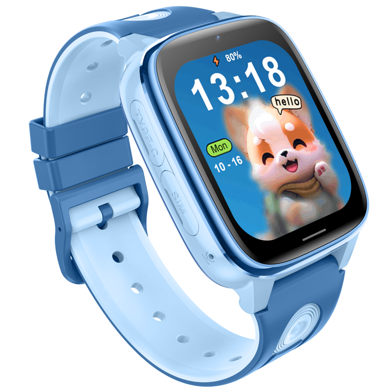

# Sentar - D51

**D51 4G Kids Smart Watch**

The D51 4G Kids Smart Watch is a compact, wearable GPS tracker designed for child safety and family communication. Plaspy compatible out of the box, the D51 brings real-time tracking and reliable 4G connectivity together with simple SOS and remote communication features so parents and caregivers can stay informed and respond quickly.

Built on an RTOS platform and driven by the AR3603C chipset, the D51 delivers multi-mode positioning \(GPS, LBS, WiFi\) and LTE connectivity across common FDD and TDD bands. When paired with Plaspy, the watch streams location updates, SOS events, and device telemetry into a single dashboard for easy monitoring and alerting.

## Key Highlights

- Plaspy compatible wearable GPS tracker for child safety and family communications.
- Real-time tracking over 4G LTE with multi-mode positioning \(GPS, LBS, WiFi\) for improved accuracy.
- Built-in SOS emergency calling and remote communication to help parents respond fast.
- 1.83-inch LCD touchscreen \(240×284\) and a basic 0.08MP camera for simple photo capture and interaction.
- Long-lasting 640mAh battery that supports extended daily use for busy families on the go.
- Supports multiple LTE frequency bands \(FDD-LTE B1/B3/B5/B8 and TDD-LTE B38/B39/B40/B41\) for broad area coverage.
- Compact wearable form factor that’s easy for children to wear and for parents to manage via Plaspy.

## How It Works with Plaspy

The D51 integrates with Plaspy to provide continuous, actionable location and device data. Position fixes and device telemetry are relayed via the watch’s 4G connection to Plaspy servers, where they appear as real-time points on maps, within alerts, and in historical reports. Plaspy's platform turns the D51’s basic sensor and communication data into practical safety workflows—geofences, SOS escalation, location history, and device health monitoring.

- Real-time location and telemetry updates from GPS, LBS, and WiFi positioning.
- SOS emergency calling and alert forwarding to Plaspy for immediate notification and escalation.
- Two-way remote communication capability for voice or messaging where supported by the watch.
- Battery level and device status reporting so caregivers see device health in Plaspy dashboards.
- Location history and geofence alerts for proactive monitoring and quick incident response.

## Technical Overview

| Connectivity | 4G LTE \(FDD/TDD\), Nano SIM slot |
| --- | --- |
| Bands | FDD-LTE: B1, B3, B5, B8. TDD-LTE: B38, B39, B40, B41 |
| Power & Battery | 640mAh battery for extended usage \(backup battery not specified\) |
| Interfaces | 1.83" LCD touchscreen \(240×284\), Nano SIM slot, 0.08MP camera, SOS emergency calling |
| GNSS | Multi-mode positioning: GPS plus LBS and WiFi \(accuracy not specified\) |
| Bluetooth | Not specified |
| Remote Management | RTOS based; remote management specifics \(FOTA/web tools\) not specified |
| Form Factor | Child wearable watch, compact design for daily wear |
| Processor & Memory | AR3603C main chipset, 8MB + 16MB system memory |

## Use Cases

- Child safety tracking: monitor location in real time and receive SOS alerts for fast response.
- Family communication: two-way calling and messaging for checking in during school, after activities, or on trips.
- School and daycare check-ins: location history and geofence alerts help confirm arrivals and departures.
- Outdoor activities and excursions: GPS + WiFi/LBS positioning improves location accuracy in mixed environments.

## Why Choose This Tracker with Plaspy

The D51 4G Kids Smart Watch is a purpose-built GPS tracker for parents and caregivers who need dependable, Plaspy compatible real-time tracking and emergency features in a child-friendly wearable. Its broad LTE band support and multi-mode positioning deliver robust coverage and consistent location data, while the 640mAh battery keeps monitoring active throughout the day. When combined with Plaspy, the D51’s location feeds, SOS alerts, and device telemetry become integrated safety workflows that simplify monitoring and response.

Note that Plaspy supports a wide range of GPS tracker types. While vehicle-focused devices on Plaspy may include telemetry for ignition, immobilizer control, fuel monitoring, and Bluetooth sensors for asset sensing, the D51 is optimized for personal safety, location monitoring, and communication rather than vehicle telematics or anti-theft vehicle immobilization. For families seeking a reliable Plaspy compatible wearable GPS tracker, the D51 offers straightforward integration, real-time tracking, and essential safety features tailored to children and caregivers.

