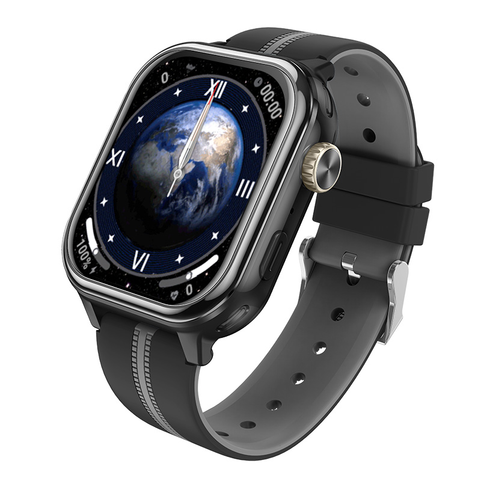

# Sentar - D52-R9

# D52-R9 Smartwatch \(Plaspy compatible\)

The D52-R9 is a Plaspy compatible children's smartwatch designed for dependable, real-time tracking and family communication. Built for child safety, the device supports 5G NR Sub‑6 standalone \(SA\) and 4G LTE connectivity and delivers precise location via GPS with LBS and Wi‑Fi fallback depending on configuration. As a GPS tracker optimized for wearable use, the D52-R9 helps parents maintain continuous situational awareness with voice and video calling plus geofencing alerts.

Plaspy compatibility means the D52-R9 can feed location, geofence events, and status updates into a unified tracking platform for immediate alerts, mapping and historical telemetry. Although the D52-R9 is primarily a personal safety smartwatch, its real‑time tracking and alert streams integrate with Plaspy to support a range of monitoring workflows — from family safety to personal anti‑theft and presence monitoring.

## Key Highlights

- 5G NR Sub‑6 SA and 4G LTE connectivity for fast, reliable real‑time tracking and communications.
- Multi‑mode positioning: GPS with LBS and Wi‑Fi fallback for improved accuracy in diverse environments.
- Voice calling and video calling to keep families connected through the Plaspy platform.
- Geofencing alerts that trigger immediate notifications to Plaspy when boundaries are entered or exited.
- Child‑friendly, durable form factor designed for everyday wear and active use.
- Optimized for location safety and telemetry reporting to Plaspy; useful as a personal GPS tracker and anti‑theft aid.
- Broad global band support to maintain coverage across multiple regions and carriers.

## How It Works with Plaspy

The D52-R9 transmits location and event telemetry to Plaspy over cellular networks so you get near real‑time visibility in the Plaspy dashboard or API. Location fixes, geofence triggers, and communication status are logged and presented as actionable events. Plaspy processes this incoming stream for mapping, historical playback and alerting rules, enabling automated notifications to caregivers or operations teams.

- Real‑time location and telemetry updates delivered to Plaspy for live tracking and history playback.
- Geofencing alerts: entry/exit events push to Plaspy for immediate notifications and workflows.
- Voice and video call presence and status available via the device and represented in Plaspy event logs.
- Multi‑source positioning \(GPS, LBS, Wi‑Fi\) provides resilient location reporting in urban, indoor and outdoor scenarios.
- Event-driven telemetry from the watch feeds Plaspy for notifications, mapping and audit trails.

## Technical Overview

| Connectivity | 5G NR Sub‑6 \(standalone\) and 4G LTE capable |
| --- | --- |
| Bands | 5G NR: N1, N2, N3, N5, N7, N8, N28, N41, N77, N78, N79. LTE: B1, B2, B3, B5, B7, B8, B28, B34, B38, B39, B40, B41. |
| Power & Battery | Internal rechargeable battery \(battery capacity and runtime not specified in description\) |
| Interfaces | Voice calling and video calling interfaces \(implies microphone, speaker and camera\); other physical I/O not specified |
| GNSS / Positioning | GPS positioning; LBS and Wi‑Fi positioning available depending on configuration |
| Bluetooth | Not specified |
| Remote Management | Not specified \(Plaspy integration available for telemetry and event ingestion\) |
| Form Factor | Children's smartwatch — durable, child‑friendly design for everyday use |

## Use Cases

- Child safety and family communication — real‑time GPS tracker and calling to keep caregivers connected.
- School commute monitoring — geofence and arrival/departure alerts to confirm safe travel to/from school.
- Emergency check‑ins — instant location and call capability for rapid response and reassurance.
- Neighborhood anti‑theft monitoring — wearable tracking and alerts can help locate a lost or stolen device.
- Personal presence telemetry — historical location playback and event logs for audit and peace of mind.

## Why Choose This Tracker with Plaspy

Choosing the D52-R9 for Plaspy integration gives you a purpose‑built wearable GPS tracker that balances reliable connectivity with child‑oriented features. Its comprehensive band support and 5G NR/4G LTE capability reduce coverage gaps, while GPS plus LBS and Wi‑Fi positioning improve accuracy in mixed environments. When paired with Plaspy, location and telemetry flow into a mature platform for real‑time tracking, alerting and historical analysis.

Note on scope: the D52-R9 is optimized for personal and family safety rather than vehicle telematics. It does not list vehicle telemetry features such as fuel monitoring, ignition control or immobilizer functionality. If your Plaspy deployment requires fleet management, fuel monitoring, ignition or immobilizer control, those capabilities are typically provided by dedicated vehicle trackers; the D52-R9 serves best as a wearable GPS tracker for people and personal assets. Bluetooth sensors and other peripheral interfaces were not specified in the product description.

