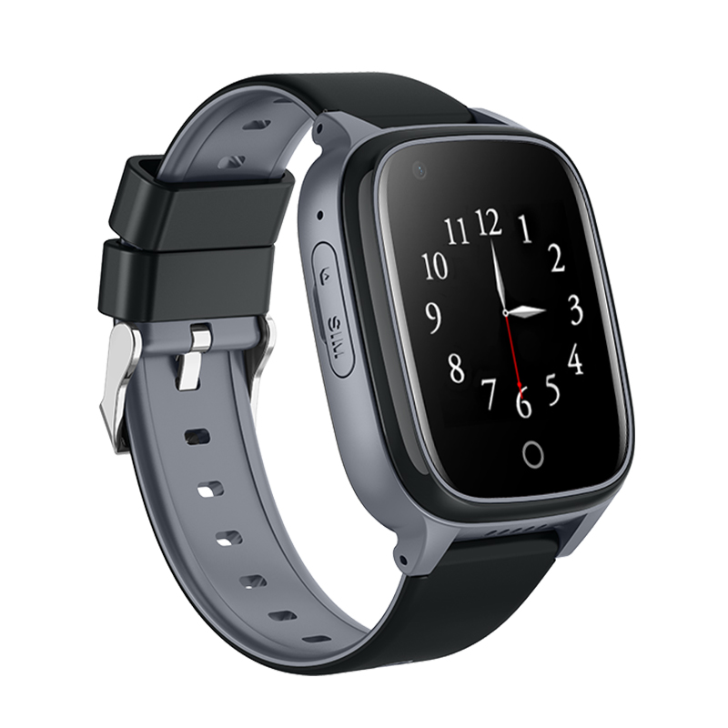

# Sentar - Elderly

The 4G Elderly GPS Watch is a Plaspy compatible wearable GPS tracker designed for seniors and vulnerable users who need reliable, easy-to-use location and safety services. With full 4G cellular support and multiple positioning technologies \(GPS, AGPS, LBS and WiFi\), this watch provides precise real-time tracking and a clear on-device experience via a 1.4-inch IPS touchscreen. Its SOS emergency button, long-lasting 700mAh battery and IPX7 water resistance make it a practical option for day-to-day safety monitoring.

Built on an Android 4.4 platform with an SL8521E processor, 512MB RAM and 4GB ROM, the 4G Elderly GPS Watch offers a balance of performance and simplicity. As a Plaspy compatible device, it can be registered in Plaspy for centralized visibility of location, alerts and basic telemetry — supporting families, caregivers and monitoring services that value dependable, real-time tracking and event notifications.

## Key Highlights

- Plaspy compatible wearable GPS tracker for seniors — real-time tracking and emergency alerting in a compact wrist form factor.
- Multi-mode positioning: GPS, AGPS, LBS and WiFi location combine to improve accuracy indoors and outdoors.
- 4G cellular connectivity \(FDD-LTE/WCDMA/GSM\) for reliable data uplink and wide-area coverage.
- On-device safety features: dedicated SOS button for immediate alerts and a built-in camera for quick situational checks.
- Long-lasting 700mAh rechargeable battery and magnetic 4-pin charging for convenient daily use.
- Durable design with IPX7 waterproofing suitable for daily water exposure and available in Blue, Pink and Black.
- Lightweight interface: 1.4-inch IPS touch screen \(240x240\) that’s easy to read and operate for older users.

## How It Works with Plaspy

When set up as a Plaspy compatible tracker, the 4G Elderly GPS Watch transmits location data and key status events over cellular networks to the Plaspy platform for centralized monitoring. Plaspy presents live location on maps, stores position history, and issues alerts for SOS events or low battery levels so caregivers can respond quickly. Because Plaspy supports a range of device types, you can manage personal wearables alongside vehicle and asset trackers from the same dashboard.

- Real-time location and telemetry updates via 4G/WCDMA/GSM networks \(GPS/AGPS/LBS/WiFi\).
- SOS emergency button events are forwarded to Plaspy for immediate notification and location context.
- Battery status and basic device health data can be reported to Plaspy to help maintain continuous monitoring.
- Photo capture from the built-in camera can be used for situational awareness where supported by the platform \(subject to device permissions and configuration\).
- Note: Plaspy also supports advanced telemetry for vehicle trackers — such as fuel monitoring, ignition and immobilizer controls or Bluetooth sensors — which are not features of this wearable watch but can be managed together in Plaspy’s interface when using mixed fleets of devices.

## Technical Overview

| Model | 4G Elderly GPS Watch |
| --- | --- |
| Operating System | Android 4.4 |
| Processor & Memory | SL8521E processor, 512MB RAM, 4GB ROM |
| Connectivity | FDD-LTE, WCDMA, GSM \(Nano SIM slot\) |
| Bands | FDD-LTE: B1/B2/B3/B5/B7/B8/B20/B28A; WCDMA: B1/B2/B5/B8; GSM: B2/B3/B5/B8 |
| Power & Battery | 700mAh rechargeable polymer battery; magnetic 4-pin charging cable; extended operational time |
| GNSS & Positioning | Built-in GPS chipset with GPS, AGPS, LBS and WiFi location support |
| Display | 1.4-inch IPS color touchscreen, 240 x 240 resolution |
| Camera | 30W built-in camera \(on-device camera module\) |
| Water Resistance | IPX7 \(suitable for daily water exposure\) |
| Inputs/Controls | Dedicated SOS button; touchscreen controls |
| Bluetooth | Not specified |
| Remote Management | Android 4.4 platform; remote management specifics \(FOTA, device portal\) not specified |
| Form Factor | Wearable watch; available colors: Blue, Pink, Black |

## Use Cases

- Elder care monitoring: continuous location visibility and one-touch SOS for seniors living independently.
- Caregiver coordination: centralize alerts and location history in Plaspy for family members and care services.
- Daily activity tracking: step counting and sedentary reminders provide basic activity telemetry to support well-being checks.
- Short-term supervision: temporary monitoring of vulnerable users during travel or day trips using cellular real-time tracking.
- Mixed-device monitoring: manage personal wearables alongside vehicle trackers in Plaspy — combining personal safety with fleet management tools.

## Why Choose This Tracker with Plaspy

The 4G Elderly GPS Watch offers a practical balance of safety features and Plaspy compatibility for organizations and families that need dependable personal tracking. Its multi-mode positioning and 4G connectivity deliver accurate, real-time tracking while the SOS button and camera provide rapid situational response options. Pairing the watch with Plaspy gives caregivers a single pane of glass for monitoring location and events, even when you also manage vehicle fleets or assets that require telemetry like fuel monitoring, ignition status or immobilizer controls. Choose this Plaspy compatible wearable when you want a focused, reliable personal GPS tracker that integrates into a broader monitoring ecosystem without unnecessary complexity.

