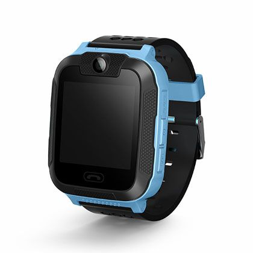

# Sentar - L80

The Sentar L80 is a 3G kids GPS watch designed to provide parents and caregivers with continuous visibility of a child’s location and basic two way communication. It combines a purpose built form factor for children with multiple location modes and an SOS function to help manage everyday safety needs. The model is offered in kid friendly color options and includes features like voice communication and geo fencing that are commonly sought in child focused trackers.

As a device compatible with Plaspy, the L80 can be integrated into a central tracking platform to deliver map based visibility, alerting and history for monitored devices. Plaspy can ingest the L80’s location updates and event signals to present location history, geofence alerts, and emergency notifications alongside other tracked assets, making the watch useful for families, care providers, and organizations that require consolidated oversight.

## Key Highlights

- Compact 3G kids GPS watch form factor designed for everyday child wear
- MT6572A chipset cited for fast and accurate location tracking
- Multiple location modes supported including GPS, AGPS, LBS, and WiFi
- Built in microphone and speaker for two way voice communication
- Dedicated SOS button for emergency alerts
- Geo fence function to define safe zones and generate alerts
- Available in kid friendly colors with an adjustable strap for comfort

## How It Works with Plaspy

When used with Plaspy, the Sentar L80 supplies location and event data that Plaspy presents alongside other devices in a unified fleet and asset view. Integration enables parents or administrators to monitor movement, respond to alerts, and review historical activity from a single platform.

- Real time and near real time location display on Plaspy maps for quick situational awareness
- Geofence creation and alerting in Plaspy based on the L80 geo fence events
- SOS and alert notifications surfaced through Plaspy to highlight urgent events
- Location history and route playback for review and reporting inside Plaspy
- Grouping and monitoring of multiple L80 units for consolidated oversight

## Typical Use Cases

- Parental monitoring for daily school runs, playtime, and outings
- Daycare or after school program oversight for enrolled children
- Coordinating pick up and drop off with real time location checks
- Short trips and excursions where a compact wearable tracking device is preferred
- Organizations requiring a child focused device visible within a broader tracking platform

## Why Choose This Tracker with Plaspy

The Sentar L80 is suitable for users who need a child oriented wearable that provides location visibility and basic communication features. Its multi mode positioning and SOS capability make it a practical option for families and care providers who want straightforward tracking combined with an emergency alert function.

Paired with Plaspy, the L80 becomes part of a centralized monitoring workflow that helps simplify oversight across multiple devices and locations. Plaspy’s map views, alert handling, and history features let you manage L80 units alongside other assets without needing separate systems, keeping operational visibility consolidated and easier to act on.

To learn more about how the Sentar L80 can work within the Plaspy platform visit https://www.plaspy.com. Product specifications, availability, and manufacturer details can change over time, so please verify current specifications on the manufacturer site http://www.sentarsmart.com/ before making purchasing or deployment decisions.
