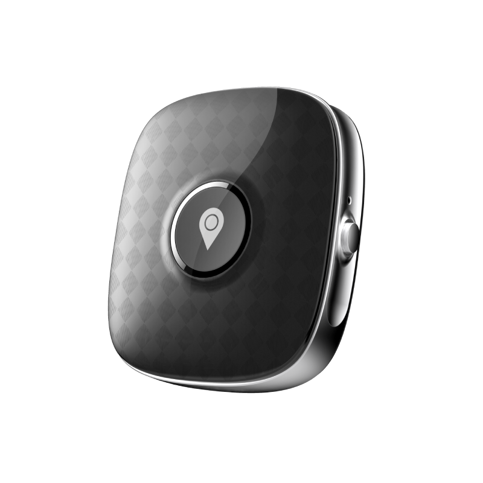

# Sentar - Mini

The Sentar Mini is a compact 4G GPS tracker designed for personal and small asset tracking. It combines multi mode positioning with worldwide cellular support to deliver continuous location updates and status telemetry. The device is described as compact and portable, with an IPX7 waterproof rating and a rechargeable battery, making it suitable for everyday use on people, pets, luggage, and similar small items.

As a Plaspy compatible device, the Mini integrates with Plaspy’s device onboarding and tracking dashboard to provide real time location, device health, and location history. Its multi mode positioning helps Plaspy receive suitable fixes in a range of environments, while the small form factor and selectable colors make deployments less intrusive for family and organizational use.

## Key Highlights

- Plaspy compatible for real time tracking and location history via cellular uplink and multi mode positioning.
- Multi mode positioning including GPS, AGPS, LBS, and WiFi to improve location fixes in varied environments.
- Global cellular support across 4G 3G and 2G for broad coverage and international use.
- IPX7 waterproof rating suitable for wet conditions and accidental immersion.
- 700mAh rechargeable battery for extended portable operation and routine recharging.
- Compact, user friendly design available in Blue Pink and Black for discreet personal use.
- Built on an ASR3603S platform with 128MB RAM and 128MB ROM for responsive device operation and reliable telemetry reporting.

## How It Works with Plaspy

When used with Plaspy, the Mini transmits location and telemetry over cellular networks so Plaspy can present live tracking, alerts, and historical routes on its dashboards. Plaspy consumes incoming location fixes and device status to power geofence rules, notifications, and reporting for administrators or caregivers.

- Live location and position updates delivered to Plaspy for situational awareness and tracking.
- Battery level and device status reporting so teams can monitor uptime and charge state in Plaspy.
- Location history and route playback in Plaspy dashboards for post event review and auditing.
- Configurable alerts in Plaspy based on geofence breaches movement or low battery conditions.
- Telemetry visibility that supports operational oversight and timely response for small asset and personal monitoring.

## Typical Use Cases

- Child safety tracking with discreet wearable placement and parent alerts through Plaspy.
- Elderly or vulnerable adult monitoring for caregivers needing timely position and status updates.
- Pet tracking for outdoor activities with water resistance to tolerate accidental immersion.
- Luggage and travel asset tracking where compact form and international cellular coverage are important.
- Personal security monitoring and recovery support using real time tracking and location history.

## Why Choose This Tracker with Plaspy

The Mini is a practical choice for organizations and families that need a small, reliable tracker feeding continuous location and device health data into Plaspy. Its combination of multi mode positioning and wide cellular support helps maintain connectivity in mixed environments, while IPX7 protection and a rechargeable battery support everyday mobile use. For deployments focused on personal or small asset visibility rather than vehicle telematics, the Mini offers a straightforward pairing with Plaspy’s tracking and alerting features.

If you need more detailed technical confirmation for a specific deployment, consult the manufacturer and verify current specifications. To learn more about how Plaspy can manage Sentar Mini devices and other compatible trackers visit https://www.plaspy.com. Product specifications and availability can change over time so please verify the latest details with the manufacturer at http://www.sentarsmart.com/.
