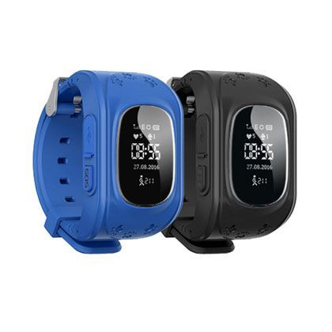

# Sentar - Q50

The Sentar Q50 Kids GPS Watch is a compact wearable designed to help parents monitor a child’s location and safety. Marketed as a user friendly wrist device, the Q50 combines location technologies and basic communication features to provide real time position updates, an SOS alert, and two way voice interaction. It is available in several colors and is built with everyday use in mind, including a waterproof design and extended battery life for longer monitoring intervals.

As a Plaspy compatible device, the Q50 can feed location and event data into Plaspy for consolidated visibility and oversight. Plaspy users can incorporate the Q50 into existing monitoring workflows to view live positions, receive zone alerts, and keep an audit trail of events. The compatibility makes the Q50 a practical option when a small wearable needs to be tracked alongside other assets or people within the Plaspy platform.

## Key Highlights

- Designed for child safety with real time location tracking using GPS AGPS and LBS technologies
- Two way voice communication and remote listen features for simple contact and situational awareness
- Geo fencing and SOS alert support to notify caregivers of boundary events or emergencies
- Waterproof housing and long battery life for reliable day to day wear
- Available in multiple color options to suit children preferences
- Compact wearable format intended for personal monitoring and easy everyday use

## How It Works with Plaspy

When paired with Plaspy the Sentar Q50 provides a continuous stream of location updates and event notifications that Plaspy can display and record. Plaspy consolidates the Q50 feed alongside other devices so caregivers and administrators can manage monitoring from a single platform.

- Live location display on Plaspy maps for quick situational awareness
- Geo fence alerts routed through Plaspy for entry and exit notifications
- SOS and emergency events highlighted in Plaspy for fast attention
- Historical location trail accessible in Plaspy for review and reporting
- Event logging and simple reporting to support oversight and record keeping

## Typical Use Cases

- Parental monitoring of children during school hours and extracurricular activities
- Daycare and school programs that need basic location oversight for enrolled children
- Short term supervision during family outings or group activities
- Caregiver monitoring where a compact wearable is preferred over larger tracking devices
- Situations that benefit from combined location, emergency alerting, and remote listening

## Why Choose This Tracker with Plaspy

The Sentar Q50 is a sensible option when organizations or families require a wearable that focuses on location awareness and simple communication. Its combination of real time position updates, geofencing, and an SOS function aligns with common monitoring needs that Plaspy supports, allowing caregivers to see device activity alongside other tracked items in one platform.

Because the Q50 is compact and purpose built for personal monitoring, it integrates naturally into scenarios where portability and ease of use matter. Plaspy complements the Q50 by providing central visibility, alert routing, and historical context so administrators and caregivers can maintain oversight without managing separate systems.

Learn more about Plaspy on the main website https://www.plaspy.com. Product specifications availability and manufacturer details can change over time so verify current specifications and features with the manufacturer at http://www.sentarsmart.com/ before purchase.
