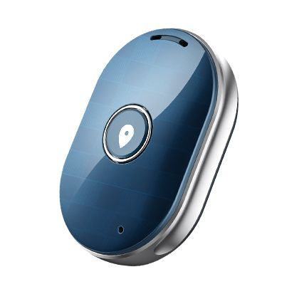

# Sentar - Q60

The Sentar Q60 GPS Tracker is a reliable and versatile device that offers accurate location tracking capabilities. Powered by the MTK2503 chipset, this tracker ensures fast and efficient performance. Whether you need to keep an eye on your vehicle, loved ones, or valuable assets, the Q60 is designed to meet your tracking needs.

With its GPS+AGPS+LBS location mode, the Q60 provides precise and real-time location information. The GPS technology allows for accurate positioning, while AGPS enhances the speed and accuracy of location tracking. In areas where GPS signals may be weak or unavailable, the LBS \(Location-Based Service\) feature kicks in, providing an alternative method of determining the device's location.

The Sentar Q60 GPS Tracker is available in three stylish colors: black, white, and blue. Its sleek and compact design makes it easy to conceal and install in various settings. Whether you want to track your vehicle discreetly or keep an eye on your loved ones without drawing attention, the Q60's design ensures seamless integration.

### Outstanding Features:

- MTK2503 chipset for fast and efficient performance
- GPS+AGPS+LBS location mode for accurate and real-time tracking
- Sleek and compact design available in black, white, and blue

