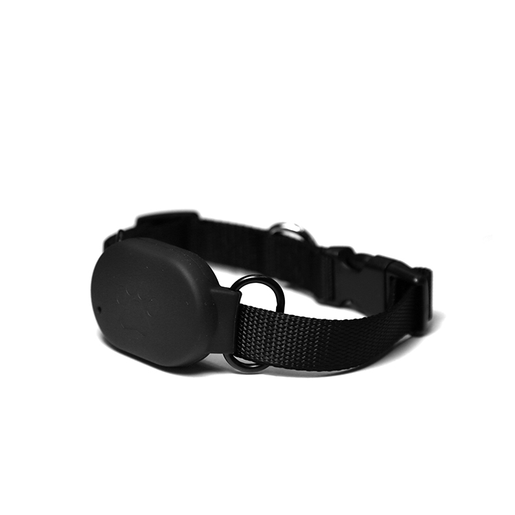

# Sentar - Q60 Pet

The Q60 Pet is a compact GPS tracker engineered for pet owners who want continuous, Plaspy compatible real-time tracking and fast location visibility. Designed around the MTK2503 chipset, the Q60 Pet combines multi-mode positioning \(GPS, BDS, LBS and WiFi\) with GSM/GPRS communications to keep you connected to your companion whether they’re exploring outdoors or hiding indoors.

The device’s small form factor, Micro SIM support and a 500mAh polymer battery make it a practical choice for everyday pet safety. As a Plaspy compatible GPS tracker, the Q60 Pet feeds reliable position and battery telemetry into the Plaspy platform so you can monitor movement, set safe zones, and receive timely alerts on your phone or dashboard.

## Key Highlights

- Plaspy compatible GPS tracker: seamless integration for real-time tracking on the Plaspy platform.
- Multi-mode positioning: GPS and BDS plus LBS and WiFi-assisted positioning for better coverage indoors and urban environments.
- Compact, pet-friendly design: lightweight form factor suitable for collars and harnesses.
- GSM/GPRS connectivity via Micro SIM \(850/900/1800/1900MHz\) for broad cellular coverage.
- Reliable battery life: built-in 500mAh polymer battery supports up to approximately 120 hours standby.
- Accurate outdoor location: GPS positioning accuracy approximately 5–15 meters for reliable outdoor tracking.
- Fallback LBS coverage: location when GPS is unavailable, with range-based accuracy around 100–1000 meters.

## How It Works with Plaspy

When paired with Plaspy, the Q60 Pet transmits position and basic telemetry over GSM/GPRS using its Micro SIM. Plaspy receives those updates and displays them in real-time on maps, timelines and alert feeds so you can track your pet’s movements and battery status from anywhere. The device’s multiple positioning modes give Plaspy a combination of GPS precision and LBS/WiFi fallback to improve visibility in challenging locations.

- Real-time location updates: GPS and BDS positions transmitted via GPRS to Plaspy for live tracking.
- Multi-mode position reports: GPS, BDS, LBS and WiFi-assisted fixes accessible to Plaspy for better indoor/outdoor coverage.
- Battery and standby telemetry: Plaspy displays device battery level and helps schedule recharging before downtime.
- Micro SIM communication: standard GSM/GPRS connectivity enables broad network compatibility for data uplink.
- Compact telemetry suited for pets: location and power status optimized for continuous pet monitoring on Plaspy.

## Technical Overview

| Model | Q60 Pet |
| --- | --- |
| Chipset | MTK2503 |
| Connectivity | GSM / GPRS |
| Bands | 850 / 900 / 1800 / 1900 MHz \(quad-band\) |
| Positioning Modes | GPS, BDS, LBS, WiFi-assisted positioning |
| GPS Positioning Accuracy | Approximately 5–15 meters |
| LBS Positioning Accuracy | Approximately 100–1000 meters \(range-based\) |
| SIM | Micro SIM \(GPRS data\) |
| Memory | 4 MB RAM + 4 MB flash memory |
| Battery | Built-in 500 mAh polymer battery |
| Standby Time | Up to approximately 120 hours \(standby\) |
| Form Factor | Compact pet tracker suitable for collar/harness mounting |

## Use Cases

- Pet safety and recovery: monitor a dog or cat’s real-time location when walking, roaming or lost.
- Indoor/outdoor visibility: WiFi and LBS modes improve position awareness when GPS signals are weak.
- Active pet monitoring: track movement patterns and activity windows for routine checks and peace of mind.
- Temporary monitoring on outings: light, collar-friendly design for day trips, hiking, or urban exploration.
- Shared household tracking: centralize multiple pets’ positions in Plaspy for easy household management.

## Why Choose This Tracker with Plaspy

The Q60 Pet offers a focused, reliable solution for pet owners who value accurate location and long standby time in a compact device. As a Plaspy compatible GPS tracker, it brings multi-mode positioning and dependable GSM/GPRS connectivity into your Plaspy dashboard for straightforward real-time tracking and telemetry. The device’s fallback positioning \(LBS and WiFi\) increases indoor visibility, while the 500mAh battery balances runtime and weight for comfortable everyday wear.

While the Q60 Pet is optimized for pet tracking and does not include vehicle-specific inputs such as ignition or immobilizer, nor fuel monitoring or Bluetooth sensor ports, Plaspy’s platform supports those telemetry types for other compatible trackers. That makes Plaspy a scalable choice if you later expand from individual pet trackers to broader fleet management, asset tracking or integrated telemetry projects.

In short, if you need a compact, Plaspy compatible GPS tracker with strong outdoor accuracy, useful indoor fallbacks, and an easy-to-manage user experience for pet safety, the Q60 Pet is a practical, reliable option that integrates seamlessly into the Plaspy real-time tracking ecosystem.

