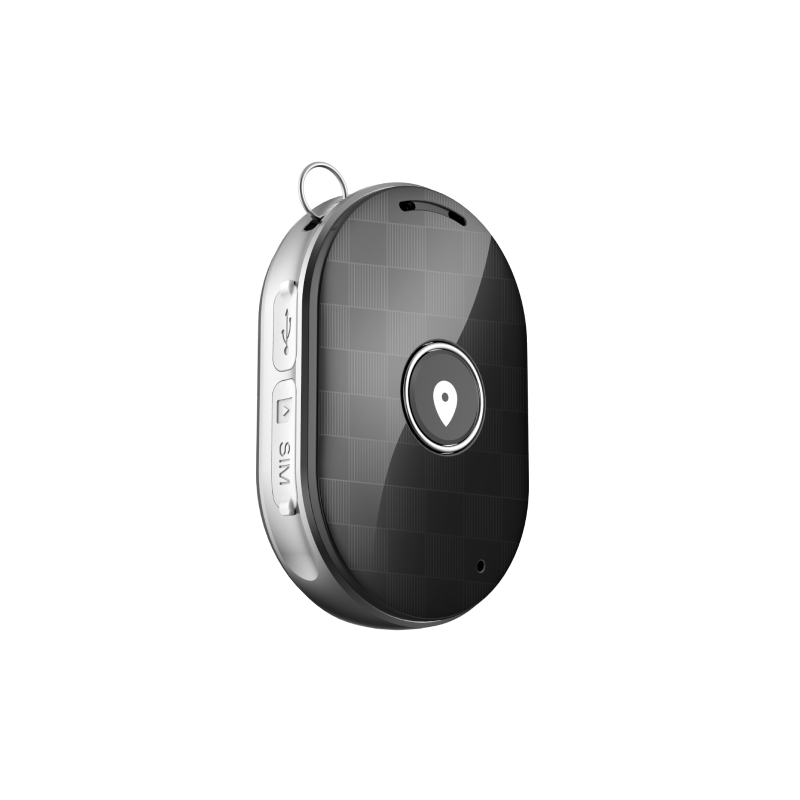

# Sentar - Q60 Tracker

The Sentar Q60 Tracker is a compact GPS tracker designed for reliable personal and movable asset location monitoring. It combines multi mode positioning, including GPS, BDS, LBS and WiFi, with a small form factor intended for discreet carry or attachment. The Q60 uses an MTK2503 chipset and GSM GPRS connectivity to deliver consistent location updates suitable for child safety, elderly care, personal security, and routine asset checks.

As a device built to integrate with Plaspy, the Q60 streams position updates and basic device status into Plaspy for mapping, alerts, and historical reporting. Its hybrid positioning approach helps maintain visibility when satellite signals are limited, making it a practical entry level option for users who want compact hardware that pairs with Plaspy for ongoing location monitoring.

## Key Highlights

- Plaspy compatible for straightforward integration with real time tracking dashboards and alerts
- Hybrid positioning using GPS, BDS, LBS and WiFi for consistent fixes in varied environments
- Compact and unobtrusive form factor suited to children, seniors, and small portable assets
- MTK2503 chipset and GSM GPRS connectivity for efficient daily tracking
- Built in 630 mAh battery designed to support extended standby use
- Nano SIM slot and modest memory footprint for simple operation and configuration

## How It Works with Plaspy

When paired with Plaspy the Q60 transmits location reports and basic telemetry to the Plaspy platform where devices are visible on maps, alerts can be configured, and historical logs are retained for review. Plaspy ingests the device's hybrid positioning so visibility continues when GNSS signals are degraded and when network based fixes are more reliable.

- Real time tracking visible within Plaspy maps and monitoring views
- Hybrid positioning data used to preserve location continuity when satellite reception is limited
- Device status reports such as power indicators can be surfaced by Plaspy for operational awareness
- Alerts and geofencing options available in Plaspy for movement, entry exit, and low power conditions
- Historical reports and exportable travel logs for analysis and record keeping

## Typical Use Cases

- Child safety monitoring where discreet carry and real time visibility are priorities
- Elderly care scenarios requiring periodic location checks and reassurance for caregivers
- Personal security for travelers, runners, or lone workers who want a compact tracker
- Movable asset monitoring for luggage, small equipment, or portable inventory
- Basic monitoring programs that need a low complexity, Plaspy compatible device

## Why Choose This Tracker with Plaspy

The Q60 offers a practical combination of compact design, hybrid positioning, and battery endurance that fits straightforward monitoring programs on Plaspy. Its focus on reliable location reporting and simple operation makes it a sensible option for individuals and small organizations that need ongoing visibility without complex telematics features.

To learn more about Plaspy and how compatible devices like the Q60 fit into the platform visit https://www.plaspy.com. Product specifications, availability, and manufacturer details can change over time, so verify current specifications and official documentation at the Sentar site http://www.sentarsmart.com/.
