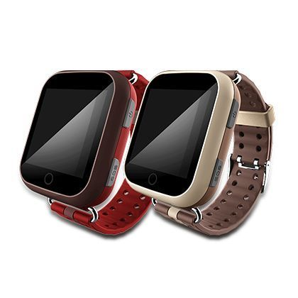

# Sentar - V82S

The Sentar V82S is a GPS tracker specifically designed for the elderly. This GPS watch is equipped with advanced features to ensure the safety and well-being of seniors. With its sleek and stylish design, the V82S is not only a functional device but also a fashionable accessory that can be worn comfortably on the wrist.

One of the standout features of the Sentar V82S is its precise location tracking capabilities. It utilizes a combination of GPS, AGPS, LBS, and WiFi technologies to provide accurate and real-time location information. This allows caregivers or family members to easily monitor the whereabouts of their loved ones, giving them peace of mind knowing that they can quickly locate them in case of an emergency.

The V82S is available in three attractive colors: brown, brownish red, and black. This allows users to choose a color that suits their personal style and preferences. The watch is also equipped with a variety of other useful features, including a built-in SOS button that can be pressed in case of an emergency, a two-way voice communication function that allows for easy communication between the wearer and their caregivers, and a long-lasting battery that ensures continuous operation throughout the day.

With its combination of style, functionality, and advanced tracking features, the Sentar V82S is an ideal GPS tracker for the elderly. Whether it's for peace of mind or to ensure the safety of a loved one, this GPS watch provides reliable and accurate location tracking, making it an invaluable device for caregivers and family members.

### Key Features:

- Precise location tracking with GPS, AGPS, LBS, and WiFi technologies
- Stylish and comfortable design
- Built-in SOS button for emergencies
- Two-way voice communication
- Long-lasting battery

