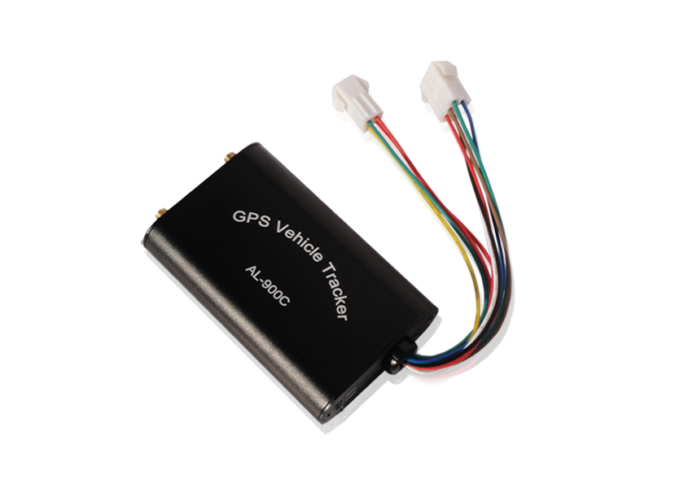

# SinoTrack - AL-900C

The SinoTrack AL-900C is a versatile GPS tracker designed to provide accurate and reliable tracking for various applications. With its robust hardware and advanced features, it offers a comprehensive solution for monitoring and managing vehicles. 

One of the standout features of the AL-900C is its wide operating temperature range, allowing it to function in extreme weather conditions, from -15°C to 80°C. It also has a high protection degree of IP53, making it resistant to dust and water splashes. This ensures that the tracker remains operational even in challenging environments. 

The AL-900C is equipped with a powerful GSM module that supports four-band GSM850/900/1800/1900 \(MHz\) connectivity. It also features GPRS multi-slot class 10 and GPRS mobile station class B, enabling seamless communication and data transmission. The GPS module, Sirf IV, provides accurate positioning with a sensitivity of -148dbm for acquisition and -159dbm for receiving. With 20 channels and a signal frequency of 1575MHz, it ensures precise and reliable location tracking. 

In terms of functionality, the AL-900C offers a range of features to enhance vehicle security and monitoring. It supports SMS location tracking, real-time location tracking via signal, and GPRS location tracking through time intervals. It also allows authorized wiretapping with an inside microphone, enabling remote listening when authorized. The tracker can send alarms for over-speed, SOS, and main power on/off events, ensuring prompt notifications for any critical situations. 

The AL-900C also provides various input and output options, including ACC, door sensor, shock sensor, and fuel sensor. It allows remote control of fuel and electricity with relays, providing additional control over the vehicle. The tracker supports parameter settings through SMS or platform, allowing customization of settings such as SMS password, SOS and wiretapping TEL number, over-speed value, and position report time interval. It also offers two-way communication, enabling drivers to talk with callers through an external microphone and speaker. 

With its comprehensive features and reliable performance, the SinoTrack AL-900C is an excellent choice for fleet management, vehicle tracking, and security applications. Its rugged design, advanced functionality, and easy parameter settings make it a versatile and user-friendly GPS tracker.

