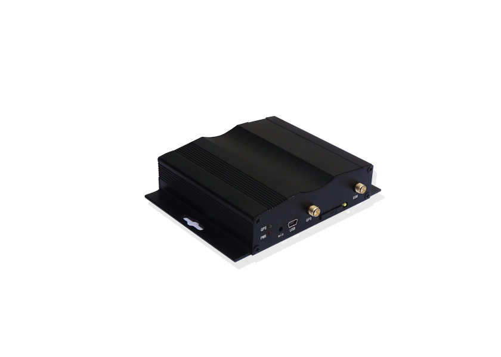

# SinoTrack - AL-900G

The SinoTrack AL-900G is a versatile GPS tracker designed for a wide range of applications. With its compact size and durable construction, it can withstand harsh operating conditions, making it suitable for use in various industries such as logistics, transportation, and fleet management.

One of the standout features of the AL-900G is its advanced GPS tracking capabilities. It utilizes a Sirf IV GPS module with 20 channels and a signal frequency of 1575MHz, providing accurate and reliable positioning. The tracker supports 24-hour satellite positioning, allowing you to track the location of your vehicle in real-time via SMS, GPRS, or through a web-based platform. It also offers multiple tracking modes, including time interval-based tracking and over-speed alarm, ensuring that you have complete control over your assets.

In addition to its tracking capabilities, the AL-900G offers a range of other useful features. It supports authorized wiretapping, allowing you to listen to the vehicle's surroundings when authorized. The tracker also has various input and output options, including ACC, door sensor, shock sensor, fuel sensor, and the ability to remotely control fuel and electricity. It also supports two-way communication, enabling you to receive and dial out calls from the tracker.

The AL-900G is equipped with a backup battery, ensuring that it continues to operate even when the main power is disconnected. It also has a break point store feature, which stores location data when the tracker is in a GSM blind area and reports the data to the platform once the GSM signal is available again. The tracker supports SD card storage, allowing you to store driving data for up to 10 years, and it can be connected to a printer for direct printing of vehicle and driver data.

With its comprehensive features and reliable performance, the SinoTrack AL-900G is an excellent choice for anyone looking for a high-quality GPS tracker for their vehicles or assets. Whether you need to track a single vehicle or manage a large fleet, this tracker offers the functionality and flexibility you need to stay in control.

