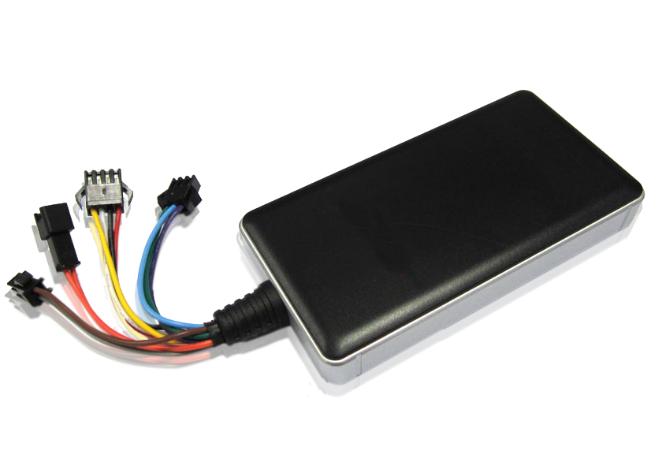

# SinoTrack - GT06N

The SinoTrack GT06N is a compact GPS tracker designed for vehicle tracking across a range of vehicle types. It offers a slim form factor and flexible power options suitable for cars, trucks, motorcycles, and similar vehicles. The device emphasizes reliable positioning and a set of practical features intended to help monitor vehicle location and basic security events.

As a Plaspy compatible device, the GT06N can be integrated into Plaspy's tracking platform to provide centralized visibility and operational oversight. Plaspy can use the tracker data to present location information, event alerts, and history for single vehicles or fleets, making the GT06N a practical choice for organizations looking to combine a compact tracker with a full fleet management interface.

## Key Highlights

- Compact and slim design for versatile use across different vehicle types
- Multiple power options for flexible installation and continuous operation
- Accurate positioning using a dedicated GPS receiver with stated 10 meter accuracy
- Onboard alarm features including main power cut off alert, shock alert, and SOS
- Remote control capabilities for fuel and power management
- Support for authorized in‑vehicle audio monitoring where permitted
- Built in switching power with a wide input range for varied vehicle systems

## How It Works with Plaspy

When paired with Plaspy, the GT06N supplies vehicle location and event information that Plaspy presents through its monitoring and reporting tools. Integration allows fleet managers and vehicle owners to track movement, receive alerts, and review historical activity within the Plaspy platform.

- Real time location visibility in Plaspy for individual vehicles and aggregated fleet views
- Alerting and notifications inside Plaspy for events such as power cut off, shock, or SOS triggers
- Historical tracking and trip reports for operational review and incident investigation
- Remote command support via Plaspy where the device supports remote fuel or power control
- Consolidated monitoring of multiple GT06N units for fleet level oversight

## Typical Use Cases

- Single vehicle tracking for personal cars and motorcycles
- Small to medium fleet monitoring for businesses with mixed vehicle types
- Theft detection and recovery workflows using location tracking and alarm alerts
- Rental vehicle monitoring and basic operational oversight
- Situations that require compact trackers with simple alarm and remote control functions

## Why Choose This Tracker with Plaspy

The GT06N is a fit for organizations that need a compact, feature focused tracker combined with a broader fleet management platform. Its positioning accuracy and included alarm functions make it useful for basic security monitoring and location reporting, while compatibility with Plaspy enables centralized access to that information alongside other fleet data.

If you require a straightforward vehicle tracker to feed location and event data into a managed platform, the GT06N and Plaspy together offer a practical combination. Plaspy provides the visibility, alerting, and reporting layers that make the device data actionable for daily operations and incident response.

To learn more about how Plaspy can work with compatible trackers like the SinoTrack GT06N visit https://www.plaspy.com. Product specifications, availability, and manufacturer details can change over time; please verify current technical information on the manufacturer's site https://www.sinotrackgps.com/.
