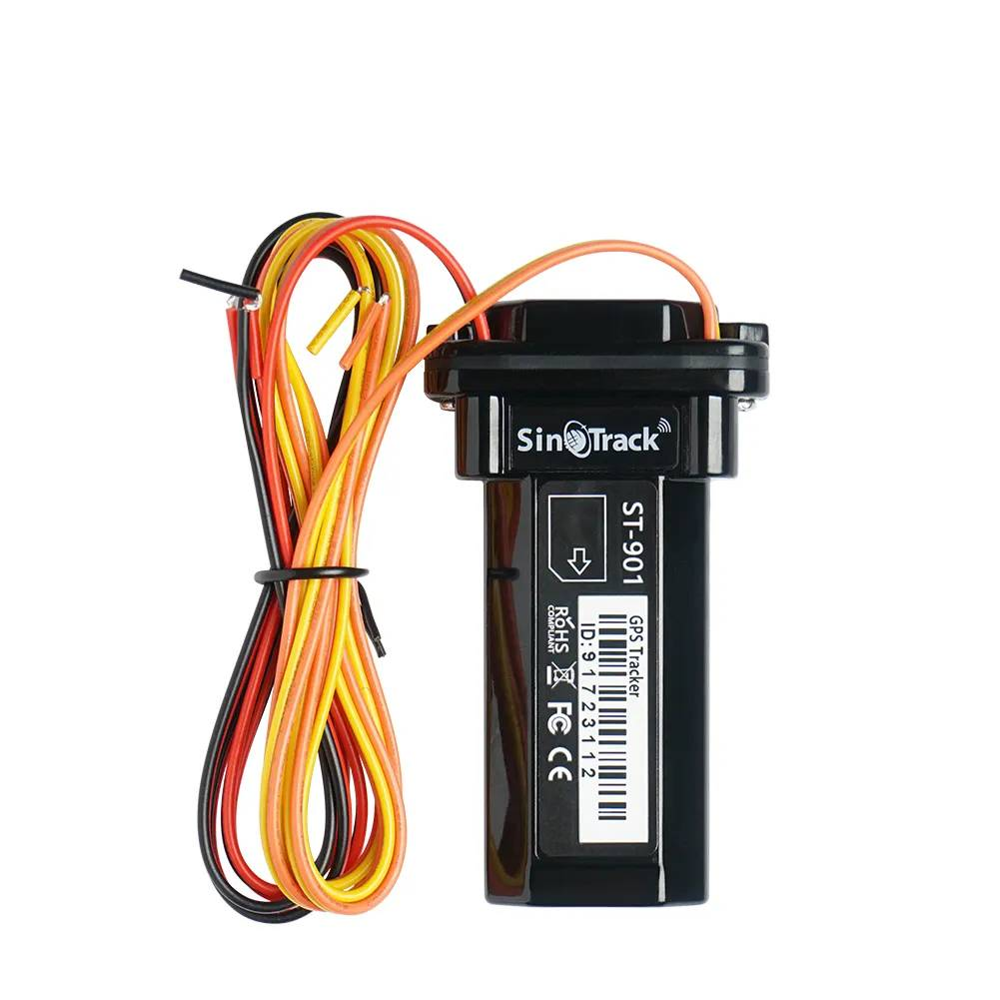

# SinoTrack - ST-901

The SinoTrack ST-901 is a compact, waterproof wired GPS tracker designed for motorcycles, scooters, cars and light trucks. Built for discreet mounting, the unit delivers GPS/GPRS/SMS positioning together with common vehicle alarms such as geo-fence and over-speed alerts, ACC ignition detection and a built-in backup battery to warn on main power loss. Its straightforward 4‑pin wiring and support for an external relay enable remote engine cut-off options for theft response.

As a Plaspy compatible device, the ST-901 can forward its location and alarm messages to third party tracking platforms when configured to report to external servers. By setting the device to send data to Plaspy’s ingestion endpoint via the manufacturer SMS commands, fleet and security teams can receive real-time tracking, telemetry and alerting inside Plaspy while retaining the option to use SinoTrack’s own monitoring apps.

## Key Highlights

- Plaspy compatible out of the box when configured to report to an external server via SMS commands
- Compact waterproof design suited to motorcycles scooters cars and light trucks
- Simple 4‑pin wiring and external relay support for remote immobilizer or engine cut-off control
- GPS/GPRS positioning with SMS alerts and convenience features such as Google Maps links for quick sharing
- Vehicle status alarms including ACC ignition detection and main power loss notification via internal backup battery
- Geo-fence and over-speed alarms for perimeter and speed based event monitoring
- SinoTrack free web platform and mobile app available alongside Plaspy integration for flexible monitoring

## How It Works with Plaspy

The ST-901 transmits positional data and alarm events using standard GPS GPRS and SMS modes. Configure the tracker with the manufacturer SMS commands to set the server address and APN so it forwards its location and events to Plaspy. Once configured, Plaspy ingests those packets and presents location, status and alarm messages for real-time visibility and operational use.

- Real-time location and telemetry updates forwarded to Plaspy for live fleet tracking
- Ignition and power state reporting so Plaspy can show ACC on/off and main power loss alerts
- Geo-fence and over-speed event forwarding for immediate alerts and historical analysis
- Remote immobilizer support via external relay to enable remote engine or fuel circuit control actions from Plaspy workflows
- SMS failover and direct alerting to provide notifications when GPRS connectivity is limited

## Typical Use Cases

- Fleet management for small vehicle fleets requiring live location and simple telemetry
- Anti-theft protection using remote immobilizer control and location alerts
- Two wheeler security where a small waterproof form factor and discreet installation matter
- Alarm driven operations that depend on geo-fence main power loss and speed alerts for incident response
- Backup notification using SMS alerts with location links when data connectivity is unreliable

## Why Choose This Tracker with Plaspy

The ST-901 is a practical option for organizations that need a compact waterproof tracker with core vehicle inputs and relay support for immobilization. Its support for standard reporting modes and SMS configuration makes it straightforward to point the device at Plaspy so teams can consolidate tracking, alerts and simple telemetry in a single platform.

Learn more about how Plaspy can work with compatible trackers by visiting https://www.plaspy.com. Product specifications and availability can change over time, so verify current device details and official documentation with the manufacturer at https://www.sinotrackgps.com/ before making deployment decisions.
