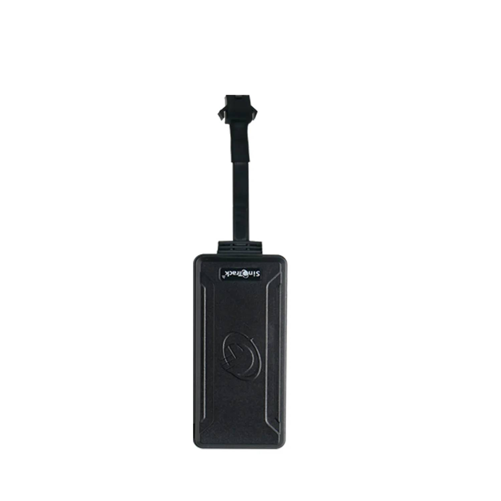

# SinoTrack - ST-901AL

The SinoTrack ST-901AL is a wired 4G LTE GPS tracker designed for reliable vehicle monitoring and security. Suited to professional installations, the ST-901AL reports position over GPRS and SMS, provides an ACC input for ignition on/off telemetry, and supports remote cut-off using an external relay. These features make it a practical option for organizations that need continuous tracking and anti-theft controls in cars, trucks, motorcycles, and similar vehicles.

This model is compatible with Plaspy because it allows configuration of APN and server settings and supports standard SMS and GPRS reporting methods. With its documented SMS commands and user-installable SIM capability, the ST-901AL can be pointed to Plaspy for real-time tracking, alerts, and fleet oversight, enabling easy integration with third-party tracking platforms.

## Key Highlights

- Wired 4G LTE tracker with quad band GSM fallback for broad mobile coverage and stable reporting.
- ACC input for reliable ignition detection and improved reporting on engine on and off events.
- Remote immobilizer support via an external relay to disable fuel or power circuits for anti theft response.
- Dual reporting channels with real time GPRS reporting and SMS fallback for resilient connectivity.
- Configurable APN and server settings plus documented SMS commands for integration with Plaspy and other platforms.
- Optional access to SinoTrack PRO mobile app and VIP.SINOTRACK web portal for alternative device management.

## How It Works with Plaspy

When integrated with Plaspy, the ST-901AL sends location and event data to the configured server address and uses SMS as a fallback channel when needed. Because the device supports APN and server configuration via SMS, installers and fleet managers can direct device traffic to Plaspy and receive tracking, alerts, and telemetry within the Plaspy platform.

- Real time location updates via GPRS with SMS as a fallback to maintain visibility in varied conditions.
- Ignition detection using the ACC input, enabling Plaspy to generate drive time reports and engine on/off analytics.
- Remote immobilizer control through relay output, which Plaspy can trigger as part of an anti theft workflow where local regulation allows.
- Alarm and event notifications such as overspeed and unauthorized use that can be translated into Plaspy alerts and workflows.
- Remote configuration by SMS to repoint APN and server settings for quick field provisioning and redeployment.

## Typical Use Cases

- Fleet management for taxis, delivery vehicles, and service fleets requiring location, ignition, and event monitoring.
- Anti theft workflows that pair real time alerts with remote immobilizer actions to respond to unauthorized use.
- Private vehicle monitoring for owners who want real time tracking and alarm notifications.
- Two wheeler and micro mobility management where a wired in line tracker is needed for consistent power and reporting.
- Operational reporting that leverages ignition events and saved interim data for usage analytics.

## Why Choose This Tracker with Plaspy

The ST-901AL is a practical fit for organizations and installers who value a wired, professional grade tracker that can be integrated into a third party platform. Its support for configurable APN and server settings, plus standard GPRS and SMS reporting methods, gives fleet managers flexibility to use their chosen SIM and backend, including Plaspy, without being tied to a single portal.

For Plaspy users, the ST-901AL offers predictable telemetry channels, ignition based insights, and relay controlled immobilizer capability that support common fleet and security workflows. Its installation focused design and manufacturer documentation help streamline deployment for mixed vehicle fleets while allowing Plaspy to centralize monitoring, alerts, and reporting.

To learn more about how Plaspy can work with devices like the ST-901AL visit https://www.plaspy.com. Product specifications, availability, and manufacturer details can change over time, so please verify current specifications and support information on the official manufacturer site https://www.sinotrackgps.com/.
