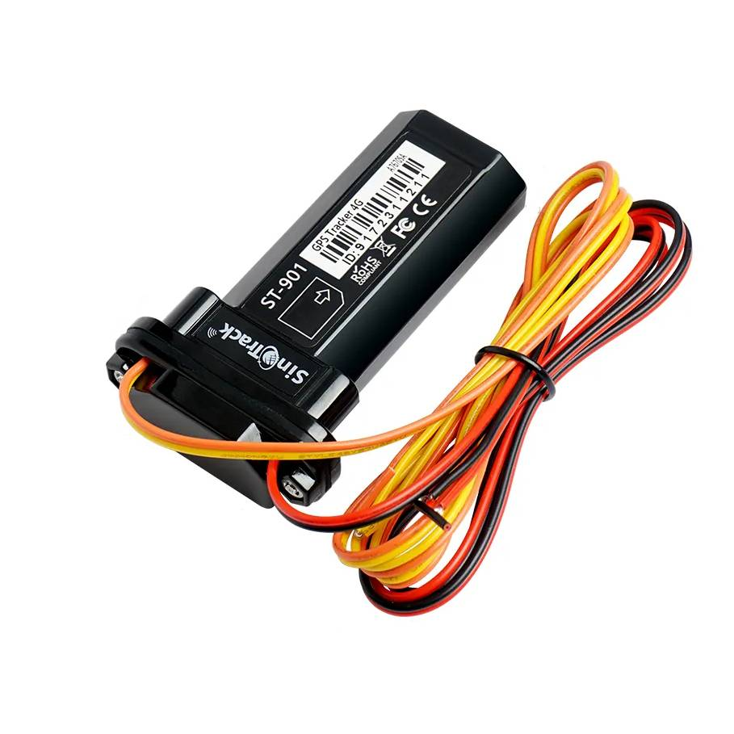

# SinoTrack - ST-901L

The SinoTrack ST-901L is a compact, vehicle grade GPS tracker designed for motorcycles, scooters and compact cars. In a mini waterproof housing it combines 4G connectivity with GSM GPRS fallback and high sensitivity built in GPS and GSM antennas to provide timely position updates, alarm reporting and simple server configuration. The unit is engineered for discreet mounting and dependable tracking in scenarios where space is limited and robustness is required.

This ST-901L model is presented as Plaspy compatible, making it a practical choice for users who want to integrate compact vehicle trackers into a centralized fleet or asset monitoring platform. With support for standard tracking channels and SMS based configuration for IP and APN settings, the device can be pointed to Plaspy for live monitoring, event processing and consolidated reporting across personal vehicles or small fleets.

## Key Highlights

- Mini waterproof vehicle grade enclosure suitable for motorcycles scooters and compact cars.
- 4G connectivity with GSM GPRS fallback for continuous position reporting.
- High sensitivity built in GPS and GSM antennas to improve location reliability in vehicle installations.
- On device alarms including ACC detection and main power off alert using an internal backup battery.
- Geo fence and over speed alerts for perimeter and speed based event detection.
- SMS based server and APN configuration to direct device data to third party platforms such as Plaspy.
- Optional external relay interface to support remote fuel or ignition cut off for anti theft workflows.

## How It Works with Plaspy

Integration with Plaspy relies on the ST-901L sending position and alarm messages over GPRS or SMS once it is configured to target a tracking server. Using the device's SMS configuration commands you can set the APN and server parameters so that location updates, alarms and status reports arrive in Plaspy for visualization and processing. Once connected, Plaspy can display live positions, raise notifications, and include the device in fleet reports and operational oversight.

- Real time location and telemetry updates delivered over 4G or GPRS into Plaspy for live tracking.
- ACC and ignition state reporting to show vehicle on off status and support rule based workflows.
- Main power off alarm sent as an event to Plaspy to detect possible tampering or power loss.
- Geo fence and over speed alerts forwarded to Plaspy for automated notifications and historical reporting.
- External relay support can be integrated into immobilization procedures when coordinated through Plaspy and appropriate command handling.

## Typical Use Cases

- Small fleet management for motorcycles scooters and compact vehicles requiring consolidated visibility and alerts.
- Motorcycle and scooter security where a compact waterproof tracker enables discreet installation and theft detection.
- Personal vehicle protection and recovery with real time location and power loss notifications.
- Remote immobilization scenarios using an external relay controlled through established workflows.
- Consolidating ignition events location history and alarm reports into Plaspy dashboards for operational insights.

## Why Choose This Tracker with Plaspy

The SinoTrack ST-901L offers a pragmatic balance of compact form factor and essential tracking features that match common fleet and security needs. Its combination of 4G connectivity built in antennas and SMS based configuration makes directing device data to Plaspy straightforward, while the alarm suite covers core telemetry and anti theft requirements for small vehicles. The optional relay interface provides a control point for immobilizer style responses when used alongside Plaspy workflows.

If you are evaluating compact GPS devices for motorcycle scooter or small car tracking the ST-901L is a credible Plaspy compatible option to consider. Learn more about Plaspy on the main website https://www.plaspy.com and verify current product specifications availability and manufacturer details on SinoTrack's official site https://www.sinotrackgps.com/ as specifications and offerings can change over time.
