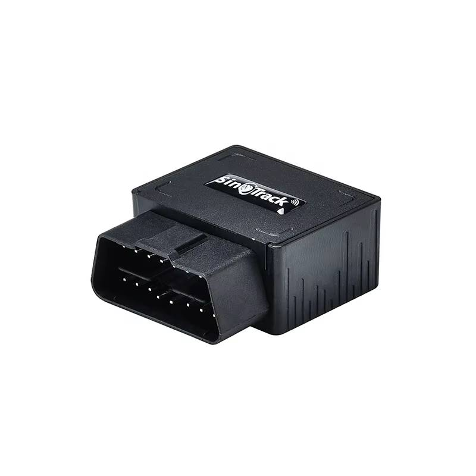

# SinoTrack - ST-902

# ST-902 OBD2 GPS Tracker \(SinoTrack\)

The ST-902 is a compact, plug-and-play OBD2 GPS tracker designed to deliver dependable, Plaspy compatible real-time tracking for cars, taxis and commercial fleets. By connecting directly to a vehicle’s standard 16‑pin OBD‑II port, the ST-902 provides continuous location updates over GSM/GPRS and supports SMS reporting — making it an ideal GPS tracker where fast deployment, fleet management efficiency and anti-theft visibility are priorities.

Easy to configure and maintain, the ST-902 includes a small internal 150mAh rechargeable backup battery, standard tracking alarms \(shock/impact, overspeed, geo-fence, low battery\) and integration options via SMS commands or a vendor platform \(SinoTrack PRO\). Because it supports standard GPRS/SMS server configuration \(IP/port\), the device can be integrated with Plaspy for centralized telemetry, reporting and alerting without complex wiring or installation.

## Key Highlights

- Plug-and-play OBD2 form factor — installs in seconds into any standard 16‑pin OBD‑II port for rapid deployment.
- GSM/GPRS connectivity for reliable real-time tracking and SMS fallback reporting.
- Core alarm suite: shock/impact alert, overspeed alarm, geo‑fence notifications and low battery warnings to support anti-theft workflows.
- Built-in 150mAh / 3.7V rechargeable backup battery for brief operation during power loss or unplug events.
- High-sensitivity UBLOX7020 GNSS receiver \(≈ -159 dB\) with roughly 10 m \(2D RMS\) location accuracy for accurate route and fleet monitoring.
- Simple SMS configuration and server IP/port assignment — ready to send telemetry to Plaspy or the included SinoTrack PRO platform.
- Two‑year warranty and vendor technical support to simplify rollout and troubleshooting at scale.

## How It Works with Plaspy

Integration with Plaspy is straightforward because the ST-902 uses standard GPRS and SMS reporting modes and allows server IP/port configuration via SMS. Configure the device to point to your Plaspy collector \(IP and port\) and the tracker will push GPS coordinates, timestamps and alarm events to Plaspy for real-time visualization, alerting and historical reports.

- Real-time location and telemetry updates sent over GPRS \(with SMS fallback\) to the Plaspy server.
- Alarm events \(shock/impact, overspeed, low battery, geo-fence\) are reported immediately so Plaspy can trigger notifications or automated responses.
- Vehicle OBD‑II data access — because the unit attaches to the OBD2 port, Plaspy can consume available vehicle telemetry \(ignition status, fuel metrics or fault data\) when those PIDs are exposed by the vehicle and enabled by configuration.
- Remote configuration via SMS \(server IP/port, APN, IMEI queries/changes\) for cases where direct device access is limited.
- SinoTrack PRO compatibility — the tracker ships ready for SinoTrack’s free lifetime platform, but can be reconfigured to send data to Plaspy for unified fleet management and telemetry dashboards.

## Technical Overview

| Connectivity | GSM / GPRS \(GPRS reporting and SMS reporting modes\) |
| --- | --- |
| Bands | GSM/GPRS \(specific band support depends on the regional variant and SIM/operator\) |
| Power & Battery | Internal rechargeable backup battery 150mAh / 3.7V; continues limited operation during power loss |
| Interfaces | Standard 16‑pin OBD‑II plug \(plug-and-play\); SMS command interface for configuration and IMEI queries/changes |
| GNSS | UBLOX7020 GNSS chip; sensitivity ≈ -159 dB; location accuracy approximately 10 m \(2D RMS\); satellite time sync ~1 µs |
| Bluetooth | Not supported / no Bluetooth sensors included |
| Remote Management | Configurable via SMS commands \(server IP/port, APN\); compatible with SinoTrack PRO web and mobile platform; IMEI change via SMS supported for applicable variants |
| Environmental | Operating temperature: -20°C to 55°C; humidity: 5%–95% non‑condensing |
| Form Factor | Compact OBD‑II plug-and-play module for vehicle use \(no wiring required\) |

## Use Cases

- Fleet management and route monitoring — quick install for vehicle onboarding and centralized telemetry in Plaspy dashboards.
- Anti-theft and tamper alerts — shock, geo-fence and low battery alarms help detect theft or unauthorized movement immediately.
- Taxi and rideshare dispatching — rapid deployment to vehicles without service bays, offering continuous position updates for dispatching.
- Short‑term rentals and car sharing — plug-in simplicity allows rapid vehicle turnover while tracking usage and incidents.
- Commercial vehicle visibility — keep tabs on vehicle location and alarm events while minimizing installation time and cost.

## Why Choose This Tracker with Plaspy

The ST-902 strikes a practical balance between simplicity and functionality for Plaspy deployments. Its OBD2 plug-and-play form factor eliminates wiring costs and speeds up rollouts, while GSM/GPRS and SMS reporting let you route data into Plaspy for real-time tracking, fleet management and telemetry. The UBLOX7020 GNSS module and core alarm set provide the essentials for anti-theft monitoring and operational oversight. For organizations that require quick activation, scalable device provisioning and vendor support, the ST-902’s 2-year warranty and SMS-based configuration make it an efficient choice.

Important operational notes: the ST-902 ships without a SIM card, so choose a local SIM and APN settings to match your carrier; device configuration to Plaspy is done by setting the platform IP and port \(SMS commands\); IMEI registration or modification requirements in certain countries should be checked prior to deployment. If your Plaspy implementation requires features such as remote immobilizer control or Bluetooth sensors, Plaspy can ingest OBD‑II telemetry from the ST-902 and combine it with additional hardware or integrations to enable those higher-level workflows.

For fleet operators and service providers looking for a Plaspy compatible GPS tracker that minimizes installation time, supports real-time tracking and delivers essential telemetry and alarm reporting, the ST-902 is a practical, reliable option backed by SinoTrack support and warranty coverage.

