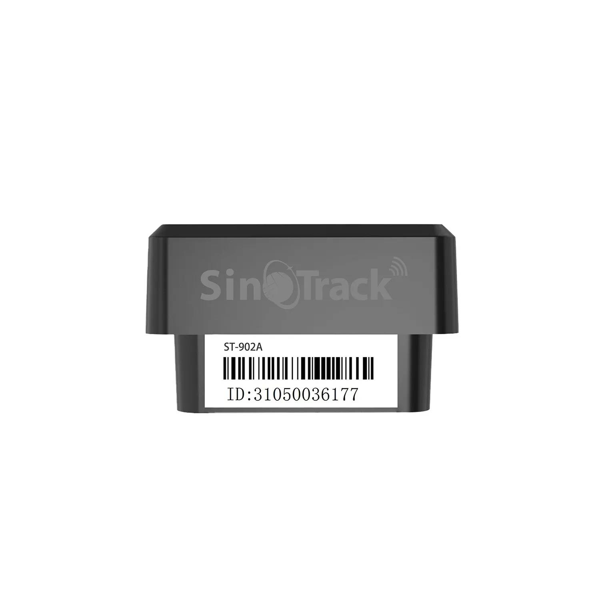

# SinoTrack - ST-902A

The ST-902A New Mini OBD GPS Tracker is a compact, plug-and-play OBD-II locator designed for fast deployment and reliable vehicle monitoring. It connects to online platforms using GPRS and can be configured by SMS, providing position, movement and alarm data from a standard 16-pin OBD port. The device includes a built-in backup battery and a u-blox GNSS receiver to maintain reporting during short power interruptions and to deliver consistent positioning for everyday fleet needs.

As a Plaspy compatible option, the ST-902A is straightforward to integrate into a Plaspy fleet management instance. Configuration by SMS allows field teams to point the device at a Plaspy server for real-time tracking, alerting and historical playback without rewiring vehicles. That ease of setup makes the ST-902A relevant for operators who need quick rollouts and dependable location visibility within Plaspy.

## Key Highlights

- True plug-and-play OBD-II installation for rapid deployment without vehicle rewiring
- Configurable by SMS to point device to Plaspy server for direct data reporting
- Real-time tracking over GPRS with SMS fallback for commands and emergency messages
- Built-in backup battery to continue reporting after vehicle power loss for anti theft resilience
- Alarm and event set including shock or vibration alerts, overspeed, low battery and geofence notifications
- Compact OBD form factor well suited to fleet vehicles rental cars and light commercial use

## How It Works with Plaspy

Integration with Plaspy is based on directing the ST-902A to deliver its telemetry to Plaspy servers and letting Plaspy ingest the incoming data for dashboard display, alerts and history. SMS configuration removes the need for special tools on site and enables quick registration of the tracker in a Plaspy deployment.

- Real-time position updates sent to Plaspy for live location and map visualization
- Event and alarm delivery to Plaspy for notifications and escalation workflows
- Historical playback of routes and movement in Plaspy for post event review and reporting
- SMS configuration and fallback to manage device server settings and receive critical alerts when GPRS is unavailable
- Simple IMEI registration and device identification to keep fleet lists accurate in Plaspy

## Typical Use Cases

- Fleet monitoring across cars and light trucks for operational oversight and route tracking
- Anti-theft and tamper detection with vibration and low battery alerts for rapid response
- Rental car and short term vehicle programs where quick swap and redeploy is required
- Geofence based operations for perimeter control delivery zone notifications and asset movement tracking
- Remote or secondary vehicle monitoring where SMS configuration and GPRS reporting are primary transports

## Why Choose This Tracker with Plaspy

The ST-902A is a pragmatic choice for teams that prioritize fast installation and clear location telemetry. Its OBD-II plug-in form factor and SMS configurable server settings make it easy to commission on site and link to Plaspy without additional wiring or specialized installation. Quad-band GPRS connectivity and a u-blox GNSS receiver deliver broad coverage and reliable positioning for routine fleet tracking and alerting needs.

For organizations that need a simple dependable tracker to feed Plaspy with location and event data, the ST-902A provides a balance of convenience and essential functionality. If your deployment requires specialized I/O or advanced vehicle integrations, consider combining the ST-902A with complementary hardware or selecting a model that exposes those interfaces. To learn more about Plaspy visit https://www.plaspy.com. Product specifications and availability can change over time, so please verify current details with the manufacturer at https://www.sinotrackgps.com/.
