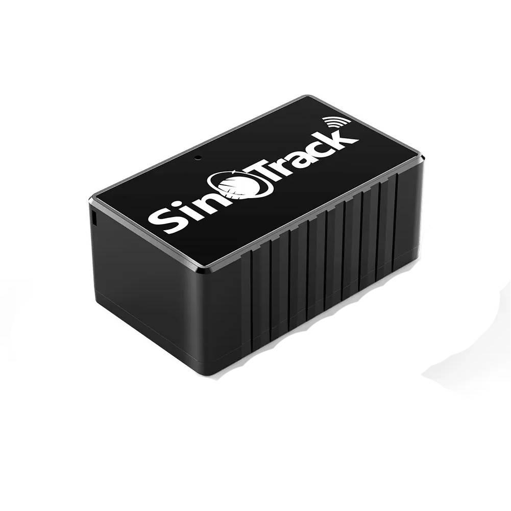

# SinoTrack - ST-903

The SinoTrack ST-903 is an ultra-compact GPS tracker designed for discreet personal and small-asset tracking. Its coin-size form factor, high-sensitivity GPS and GSM antenna, and support for GPRS and SMS reporting make it practical for collars, pockets and small hides where space and weight are constrained. The device includes multi-mode power management and a built-in battery to balance run time and update frequency for different monitoring needs.

As a Plaspy compatible device, the ST-903 can be configured to report its position and status directly to a Plaspy server. That makes it straightforward to bring discreet real-time tracking into Plaspy dashboards, alerting and history playback without hardware modification. Its SMS configuration options and fallback SMS location messages also provide useful redundancy alongside Plaspy's web and mobile interfaces.

## Key Highlights

- Ultra-compact, coin-size form factor ideal for collars and discreet attachments.
- High-sensitivity GPS and GSM antenna designed for stable positioning and communication.
- Multiple runtime profiles through power management to trade off frequency and battery life.
- Supports GPRS and SMS reporting with quick Google Maps link messages for immediate checks.
- Server IP and port configurable by SMS so the device can point to a Plaspy server.
- Built-in geofence and overspeed alarms plus history route playback for event review.

## How It Works with Plaspy

Integrating the ST-903 with Plaspy is accomplished by configuring the tracker to send its GPRS position packets to Plaspy’s server address and ensuring APN details are set for mobile data. Once pointed at Plaspy, the device provides position and event updates that Plaspy can ingest for live monitoring, alerts and historical analysis.

- Real-time location updates delivered to Plaspy for map visualization and live monitoring.
- Geofence and overspeed events reported to Plaspy so alerts and notifications can be raised.
- History and route playback available inside Plaspy for post event review and analysis.
- SMS-based configuration and fallback location messages provide a secondary control path.
- Power mode behavior influences update frequency and therefore how location data appears in Plaspy.

## Typical Use Cases

- Pet tracking for discreet collar mounting and geofence alerts to monitor outings.
- Caregiver or supervised personal tracking where compact size and quick checks matter.
- Small asset tracking for bags, portable equipment or items that require low weight attachments.
- Short term monitoring and event review where route playback is useful for analysis.
- Backup or redundancy monitoring where SMS links and manual checks complement Plaspy.

## Why Choose This Tracker with Plaspy

The ST-903 is a practical choice when you need discreet, real-time tracking without a large device footprint. Its SMS-configurable server settings allow you to direct data to Plaspy without firmware changes, enabling rapid deployment for personal and small-asset use cases. The combination of GPRS reporting, alert features and history playback fits naturally into Plaspy workflows for visibility and operational oversight.

Because the ST-903 is optimized for compact tracking, it is best used where basic position reporting, motion alerts, geofence and overspeed events meet the requirements. It is not positioned as a full telematics hub for advanced vehicle interfaces or broad sensor integrations, so organizations should consider it as a lightweight complement to other Plaspy-compatible hardware when deeper vehicle telemetry is needed. To learn more about Plaspy and how compatible devices are managed, visit https://www.plaspy.com. Product specifications and availability can change over time, so verify current technical details and official documentation on the manufacturer site https://www.sinotrackgps.com/.
