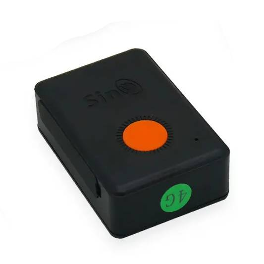

# SinoTrack - ST-904L

The SinoTrack ST-904L is a compact GPS tracker designed for discreet vehicle and personal tracking. It combines high sensitivity GPS and GSM antennas in a small housing and supports 4G LTE connectivity with 2G fallback. The device offers live position reporting via SMS and GPRS, SOS alarm and two way voice, making it suitable for motorcycles, bicycles, cars, pets and small valuable items that require reliable location updates and basic alerting.

As a Plaspy compatible device, the ST-904L can be pointed to third party servers through SMS configuration and activated on online platforms, which allows rapid integration with Plaspy for live tracking and event handling. That compatibility makes it straightforward to receive position updates, geofence and overspeed alerts, SOS events and consolidated monitoring inside Plaspy without complex changes to the tracker hardware.

## Key Highlights

- Plaspy compatible via SMS and GPRS server configuration for centralized real time tracking.
- 4G LTE connectivity with 2G fallback to improve network coverage and reporting reliability.
- Compact and discreet form factor suitable for motorcycles, bicycles, cars, pets and portable items.
- Built in 1200mAh battery with selectable power modes to balance runtime and responsiveness.
- Safety features including SOS alarm, geofence alerts and overspeed notification for rapid awareness.
- Two way voice and SMS control for direct communication and remote querying of the unit.

## How It Works with Plaspy

Integrating the ST-904L with Plaspy relies on its SMS and GPRS configuration options to set server IP and APN so the tracker reports directly to Plaspy. Once configured, the device streams position reports and event signals to Plaspy for mapping, alerts and historical playback.

- Real time location updates and breadcrumbs delivered to Plaspy for live map views and tracking history.
- SOS alarm, geofence and overspeed events forwarded to Plaspy as notifications for immediate response.
- Two way voice and SMS allow Plaspy users to contact the unit or issue remote queries when needed.
- SMS based server/IP and APN configuration lets you point the device to Plaspy without firmware changes.
- IMEI query and change options help with device registration and awareness prior to adding devices into Plaspy.

## Typical Use Cases

- Personal and family safety monitoring with SOS and two way voice for rapid communication.
- Motorcycle and bicycle security where a small discreet tracker is required for theft deterrence and recovery.
- Car anti theft monitoring and overspeed alerting integrated into Plaspy for event history and notifications.
- Tracking small valuables, luggage or portable assets that need periodic or motion triggered location updates.
- Light fleet or single vehicle monitoring where compact, location focused trackers meet basic operational needs.

## Why Choose This Tracker with Plaspy

The ST-904L is a practical option when you need a small, easy to deploy tracker that connects into Plaspy for live mapping, alerting and basic fleet oversight. Its combination of compact size, cellular connectivity and SMS based server configuration makes onboarding to Plaspy straightforward for both personal and light commercial deployments.

If your requirements center on location reporting, immediate SOS alerts and simple remote control via SMS or voice, the ST-904L pairs cleanly with Plaspy to provide centralized visibility and event handling. For deployments that demand advanced or specialized telemetry, verify the exact interfaces and capabilities before purchase to ensure they meet your needs.

To learn more about Plaspy and supported device workflows visit https://www.plaspy.com. Product specifications, availability and manufacturer details can change over time, so verify current specifications and documentation on the manufacturer site https://www.sinotrackgps.com/ before procurement.
