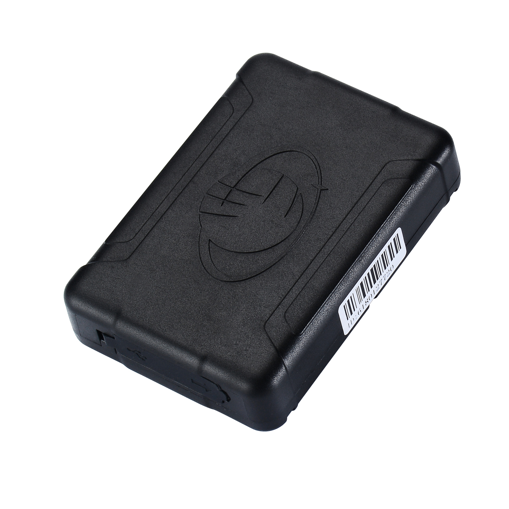

# SinoTrack - ST-905/915

The SinoTrack ST-905/915 is a compact, rugged GPS tracker designed for a wide range of tracking scenarios. It combines durable construction with a built in 10000mAh battery capable of extended standby time, positioning using a Ubox 7020 GPS module with reported position accuracy up to about 10 meters 2D RMS, and a set of alarm and monitoring features. The unit is built to tolerate outdoor conditions with a magnet and waterproof design, and supports SMS and GPRS connectivity for reporting and remote commands.

As a device known to be compatible with Plaspy, the ST-905/915 is a practical option for organizations that need long term, low maintenance tracking tied into a fleet management platform. Its long battery endurance, on device alerts such as low battery, shock, and over speed, and remote voice monitor function can be surfaced in Plaspy for operational visibility, alerting, and historical reporting, making the tracker relevant for both asset and vehicle workflows managed through Plaspy.

## Key Highlights

- Long standby capability from a large built in battery ideal for long term tracking deployments.
- Positioning accuracy around 10 meters 2D RMS using the integrated GPS module.
- Durable magnet and waterproof enclosure for outdoor and mobile asset use.
- Built in alarm features including low battery, shock, and over speed alerts.
- Remote voice monitor function for additional situational awareness when required.
- Supports SMS for basic commands and GPRS for live reporting where network coverage is available.

## How It Works with Plaspy

When connected to Plaspy, the ST-905/915 can report location and alert data to the Plaspy platform so teams can monitor assets centrally. Plaspy ingests device updates and presents them in maps, timelines, and reports, enabling operational oversight and event driven alerts.

- Live or near real time location visibility from the device when GPRS reporting is available.
- Integration of alarm events such as low battery, shock, and over speed into Plaspy alert rules and notifications.
- Historical position data and movement history for reporting, auditing, and route analysis.
- Use of SMS or GPRS channels for device command and status checks coordinated through Plaspy workflows.
- Centralized device management and status monitoring to track battery condition and device health at scale.

## Typical Use Cases

- Vehicle fleet tracking where extended battery life and rugged mounting are required.
- Motorcycle and mobile equipment tracking using the magnet mount for quick attachment.
- Long term asset monitoring for trailers, containers, or valuable equipment in the field.
- Remote or seasonal deployments where infrequent recharge cycles reduce maintenance needs.
- Security and lone worker scenarios using remote monitoring and alarm notifications.

## Why Choose This Tracker with Plaspy

The ST-905/915 is a practical choice for organizations that need a balance of durability, extended battery life, and straightforward tracking features. Combined with Plaspy, the tracker’s alarm signals and location updates can be turned into actionable alerts, historical reports, and operational dashboards that help reduce oversight overhead and improve response times.

If you want to explore how the ST-905/915 could fit into your Plaspy deployment, learn more about Plaspy on https://www.plaspy.com. Product specifications and availability can change over time, so please verify current technical details and manufacturer guidance on the official SinoTrack site https://www.sinotrackgps.com/ before making procurement or deployment decisions.
