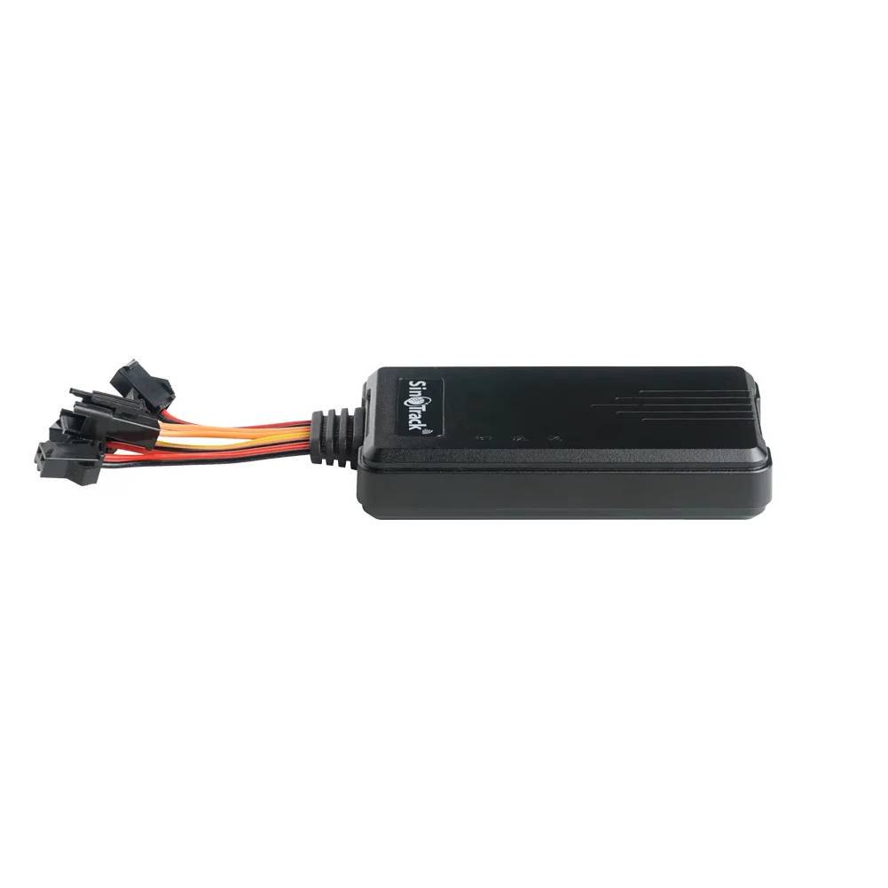

# SinoTrack - ST-906

The SinoTrack ST-906 is a compact wired vehicle GPS tracker designed for use on motorcycles, cars, trucks, e-bikes and logistics vehicles. It features a built in antenna and a straightforward SMS configuration flow that lets installers and owners set the device server, port and APN. The unit is intended for discreet on vehicle mounting and provides live position reporting together with history playback and remote SMS based configuration.

As a Plaspy compatible device, the ST-906 can be pointed to Plaspy by applying the required SMS activation commands to set the platform endpoint and APN for the installed SIM. That flexibility makes the ST-906 a practical choice for fleet managers and individual owners who want to feed vehicle location and basic telemetry into Plaspy for mapping, alerts and fleet oversight while retaining the option to use the manufacturer provided web portal and mobile app.

## Key Highlights

- Plaspy compatible via SMS based configuration of server IP port and APN so the device can report to Plaspy
- Real time tracking and history playback for route review and operational insight
- Compact wired vehicle unit with built in antenna for discreet mounting
- Remote configuration and control via SMS without needing special on site tools
- Lifetime free SinoTrack web platform and SinoTrack Pro app included while allowing user supplied SIM
- Flexible deployment across motorcycles cars trucks e bikes and logistics vehicles
- Manufacturer stated two year warranty and compliance claims where applicable

## How It Works with Plaspy

Integration with Plaspy is achieved by sending the ST-906 the SMS commands required to set the device server endpoint and APN for the SIM card. After those settings are applied the tracker will report position messages to the configured server where Plaspy can ingest them for visualization and fleet management.

- Real time location updates are sent from the tracker to the configured server once APN and server settings are applied
- History playback and location logs become available through the reporting server after the device is pointed to Plaspy
- Remote configuration via SMS allows changing APN server and port from any phone to redirect the tracker to Plaspy
- Plaspy can use received positions for mapping geolocation based alerts and operational monitoring
- Reporting dashboards and exportable logs in Plaspy support oversight and fleet performance analysis

## Typical Use Cases

- Fleet management and route monitoring for small and medium sized vehicle fleets
- Theft recovery and anti theft monitoring using live tracking and location history
- Remote monitoring for motorcycles cars and e bikes where discreet wired installation is required
- Delivery and logistics vehicles requiring route proof history and operational audits
- Owner operator or small fleet scenarios where cost conscious tracking and platform choice matter

## Why Choose This Tracker with Plaspy

The ST-906 is a practical option for organizations that need a simple wired tracker they can point to Plaspy without relying on a manufacturer bound cloud. SMS based configuration of server and APN gives installers and fleet managers the flexibility to route device reports directly into Plaspy for mapping alerts and reporting while still keeping the manufacturer platform as an alternative.

Before procurement verify local cellular band support SIM requirements and the exact wiring and input options you need by consulting the official product documentation. If you want to learn more about Plaspy and how it can receive and manage data from compatible trackers visit https://www.plaspy.com. Product specifications availability and manufacturer details can change over time so please confirm current specifications on the official SinoTrack website https://www.sinotrackgps.com/
