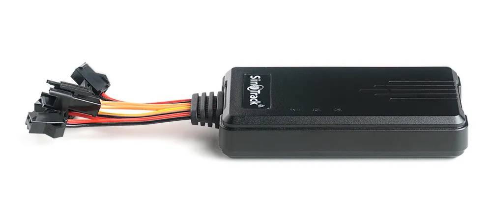

# SinoTrack - ST-906L

The SinoTrack ST-906L is a compact 4G GPS tracker engineered for cars and motorcycles and fully Plaspy compatible for seamless fleet and single-vehicle monitoring. With LTE and GSM cellular connectivity, a high‑sensitivity built‑in GPS and GSM antenna, and support for SMS, GPRS and an online platform/app, the ST-906L delivers reliable real-time tracking and essential anti-theft functions that integrate directly into Plaspy for centralized telemetry and alerting.

Designed for practical installation and everyday operation, the ST-906L pairs straightforward wiring and SIM setup with advanced safety features: ACC ignition detection, main power-off alarm, SOS panic calling, overspeed and shock alerts, geo-fence notifications, and a relay-controlled immobilizer \(oil/electricity cut\). The device includes a backup battery to report power loss and is supported by a free SinoTrack Pro web/app platform \(free for life\) that can be used alongside Plaspy for robust fleet management and historical route playback.

## Key Highlights

- Plaspy compatible for real-time tracking and centralized fleet management across vehicles and motorcycles.
- Quad‑band LTE and GSM connectivity with built‑in GPS/GSM antenna for accurate positioning in challenging environments.
- Comprehensive anti-theft toolkit: relay-controlled remote cut‑off, main power-off alarm, ACC anti-theft and SOS panic button.
- Multiple alert types—overspeed, shock, geo-fence and power loss—with immediate SMS/GPRS reporting and app/web notifications.
- Long-term value: free SinoTrack Pro platform and app for route history playback and multi-device account support; easily integrated into Plaspy workflows.
- Compact form factor tailored for motorcycle and car installation with clear SIM and wiring procedures.
- Manufacturer support: two-year warranty, 24-hour response for installation and configuration, and sample/trial orders available.

## How It Works with Plaspy

Integrating the ST-906L with Plaspy brings the tracker's live data into a unified dashboard for real-time tracking, telemetry analysis, and automated alerts. The tracker reports location and status over LTE/GPRS and SMS; Plaspy ingests that data to provide mapping, history playback, and configurable notifications. Setup is typically performed by configuring IP, port and APN via simple SMS commands and adding the device to Plaspy's platform for immediate visibility.

- Real-time location and telemetry updates delivered to Plaspy via GPRS/LTE \(and SMS where applicable\).
- Ignition and ACC status monitoring \(ACC detection and ACC anti-theft alarm\) visible in Plaspy dashboards.
- Power loss and backup battery alerts forwarded to Plaspy for continuity monitoring.
- Remote immobilizer \(relay-controlled oil/electricity cut\) can be triggered via SMS or through Plaspy if remote relay control is enabled in the platform.
- Geo-fence, overspeed, shock and SOS events are sent as alerts to Plaspy for immediate action and historical auditing.

## Technical Overview

| Connectivity | LTE-FDD, LTE-TDD, GSM; supports GPRS data and SMS reporting |
| --- | --- |
| Bands | LTE-FDD: B1/B2/B3/B4/B5/B7/B8/B12/B20/B28/B66; LTE-TDD: B34/B38/B39/B40/B41; GSM: 850/900/1800/1900 MHz |
| Power & Battery | Main power monitoring, main power-off alarm; built-in backup battery to report power failure |
| Interfaces | ACC ignition detection, SOS panic button, relay output for remote cut-off \(oil/electricity\), shock detection, digital inputs for alarms |
| GNSS | High-sensitivity built-in GPS antenna for reliable positioning and history route playback |
| Bluetooth | No built-in Bluetooth reported \(external BLE sensor integration can be handled by Plaspy where supported\) |
| Remote Management | Configurable via SMS commands \(set IP, port, APN\); web/app monitoring via SinoTrack Pro \(free for life\) and integration with Plaspy |
| Form Factor | Compact vehicle tracker optimized for motorcycles and cars; SIM card not included |

## Use Cases

- Fleet management: real-time tracking, historical route playback and multi-device account support for small-to-medium fleets using Plaspy.
- Anti-theft protection for cars and motorcycles: SOS panic alerts, main power-off alarm, and remote immobilizer \(oil/electricity cut\) to recover stolen vehicles.
- Driver safety and compliance: overspeed and shock alarms integrated into Plaspy for event logging and driver behavior analysis.
- Rental and shared vehicle monitoring: ignition and power status reporting, geo-fence enforcement and immediate alerts for unauthorized use.
- Personal emergency response: SOS button that sequentially calls controller numbers and sends alerts to Plaspy for rapid assistance.

## Why Choose This Tracker with Plaspy

Pairing the SinoTrack ST-906L with Plaspy delivers a practical, cost-effective solution for organizations and individuals who need accurate GPS tracking, robust anti-theft controls, and clear telemetry. The device’s broad LTE/GSM band support and high-sensitivity antennas make it suitable for diverse regional deployments, while the free SinoTrack Pro platform and multi-device account model provide immediate value during onboarding. For Plaspy users, the ST-906L offers easy SMS-based configuration, reliable event reporting \(ignition, power loss, overspeed, shock, geo-fence and SOS\), and remote immobilization capabilities that reduce theft risk and improve recovery outcomes.

Additional advantages include accessible installation for motorcycles and cars, manufacturer-backed two-year warranty and 24-hour customer response for setup questions. Note that no SIM card is included in the package and buyers in certain countries must handle IMEI registration or changes per local regulations; check regional requirements before deployment. If you need a compact, Plaspy compatible GPS tracker that balances anti-theft features, real-time tracking and fleet-ready telemetry, the ST-906L is a solid option to evaluate.

