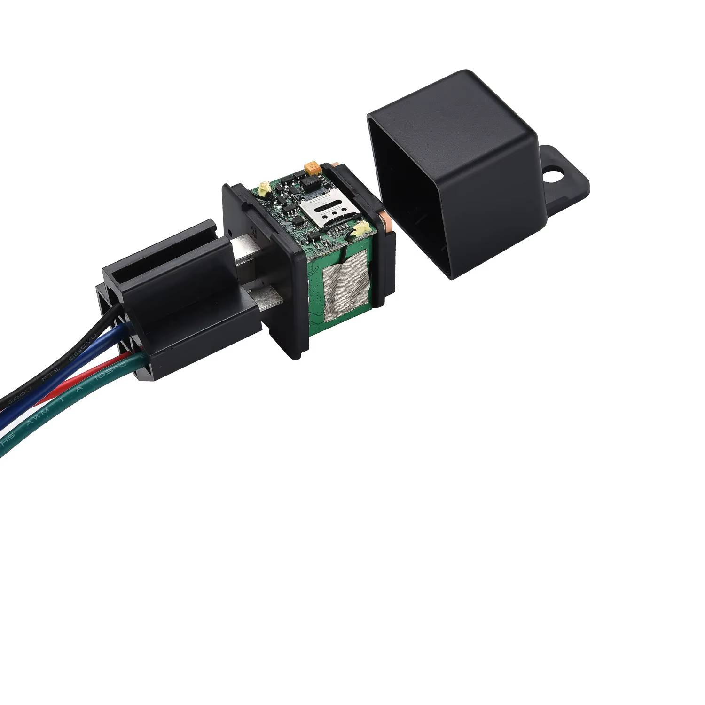

# SinoTrack - ST-907

The SinoTrack ST-907 is a compact wired GPS tracker designed for discreet vehicle installation and continuous position reporting. It combines a mini form factor with built in high sensitivity GPS and GSM antennas and quad band GSM support, allowing the device to send location and alarm data through SMS and GPRS. The ST-907 includes relay based remote control for fuel or power cut, overspeed and geofence alarm options, and SMS based diagnostic and administrative commands for onsite control.

This model is relevant for Plaspy users because it supports configurable server IP and port settings and can be pointed to third party platforms for real time monitoring. By configuring APN and the device server parameters, the ST-907 can report position updates and alarm events to Plaspy so fleets and administrators receive live tracking, alerts, and consolidated reporting inside the Plaspy platform.

## Key Highlights

- Compact wired tracker suitable for concealed installation in cars, motorcycles and light commercial vehicles.
- Reports position and alarms over SMS and GPRS for real time tracking and SMS fallback.
- Configurable server IP and port to forward data to third party platforms such as Plaspy.
- Relay based remote control to cut fuel or power circuits for immobilizer type functions.
- Built in high sensitivity GPS and GSM antennas for reliable position fixes in typical vehicle environments.
- Supports overspeed and geofence alarms plus SMS diagnostics and authorized number control.

## How It Works with Plaspy

When configured for Plaspy, the ST-907 delivers location updates and alarm events to the platform so operators can monitor vehicle movement and respond to incidents. The device uses its GPRS connection for continuous reporting and can fall back to SMS if needed; installers set APN and server settings so messages are sent to Plaspy’s ingestion endpoint.

- Real time location reporting via GPRS and SMS fallback to maintain visibility.
- Forwarded alarm events such as overspeed and geofence breaches appear in Plaspy as actionable alerts.
- Relay based immobilizer actions can be integrated as remote control events where Plaspy supports device commands.
- SMS based configuration and authorized number management provide local control and quick troubleshooting when network access is limited.
- Data sent from the device enables Plaspy to populate maps, event logs, and historical reports for operational oversight.

## Typical Use Cases

- Small fleet tracking for delivery and service vehicles requiring geofence and overspeed alerts.
- Anti theft and vehicle recovery scenarios using remote immobilizer and alarm reporting.
- Taxi and ride hailing operations needing discreet installation and authorized number management.
- Motorcycle and private vehicle tracking where a mini form factor and SMS/GPRS reporting are preferred.
- Logistics and light commercial vehicles that benefit from basic telemetry and event notifications.

## Why Choose This Tracker with Plaspy

The ST-907 is a practical choice for organizations that need a compact wired tracker with flexible reporting options and basic immobilizer capability. Its ability to be configured to report to a third party server makes it straightforward to integrate with Plaspy for map based monitoring, alerting, and routine reporting without requiring alternative vendor platforms.

If you are considering the ST-907 for use with Plaspy, confirm Plaspy’s recommended server settings and any platform authentication requirements before deployment so the device can be initialized correctly. Learn more about Plaspy and how compatible devices are used for fleet management and monitoring at https://www.plaspy.com and verify current product specifications and manufacturer details on SinoTrack’s official site https://www.sinotrackgps.com/ as specifications and availability can change over time.
